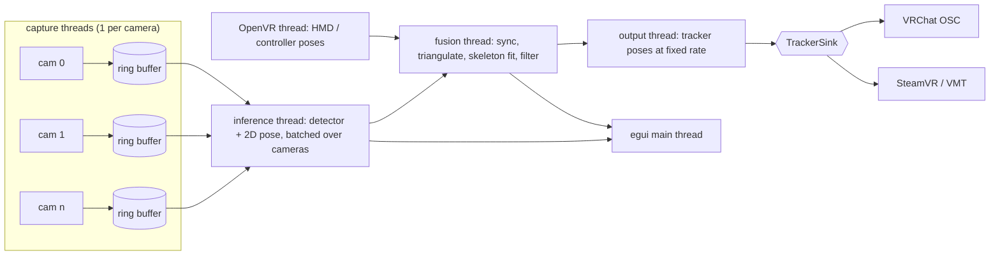

# Optra Design Document

Optra is a multi-webcam lower-body tracking application for VRChat / SteamVR.
It observes the user with 2-4 fixed ceiling-mounted webcams, estimates 2D
keypoints per view with ONNX models, triangulates them into a 3D skeleton in
the SteamVR play-space coordinate frame, and streams virtual tracker poses to
VRChat (OSC Trackers) or to SteamVR (virtual tracker driver).

## 1. Target environment

| Item | Assumption |
|---|---|
| OS | Windows 11 (primary). Linux is not a target for the first release. |
| GPU | AMD or NVIDIA discrete GPU. Inference runs through ONNX Runtime DirectML. |
| HMD | Quest-class 3-point tracking driven by SteamVR. |
| Cameras | 2-4 USB webcams, fixed at ceiling corners, looking down at the user. Models may be mixed freely; see section 6.1. |
| Consumer | VRChat, running under SteamVR. |

Because the cameras never move, extrinsics are solved once per room layout and
reused; only a quick sanity check is needed at each session start.

## 2. Design decisions

These are the decisions that shape everything below.

1. **Output backends are pluggable, both are supported.** A `TrackerSink`
   trait with two implementations: VRChat OSC Trackers (default, no driver
   install) and a SteamVR virtual tracker driver via VMT (OSC-driven,
   MIT-licensed). The user selects the active sink in the UI.
2. **Extrinsics come from the HMD, not from a printed board.** While the user
   walks around the room wearing the headset, Optra records the OpenVR HMD pose
   and the head keypoint detected in each camera image. Those 3D-2D
   correspondences give a full camera resection per view. This puts the camera
   frame and the SteamVR play space into the *same* coordinate system from the
   start, which removes an entire class of alignment bugs.
3. **3-8 trackers, user configurable.** Hips + both feet is the default; chest,
   knees and elbows can be enabled individually.
4. **DirectML only.** One code path that works on AMD and NVIDIA alike. CPU
   execution stays available as a fallback for debugging.
5. **Multi-view triangulation, not per-view 3D regression.** With 2-4 calibrated
   fixed cameras, triangulating 2D keypoints is both more accurate and cheaper
   than running monocular 3D models and fusing their outputs. Monocular 3D
   models are therefore not part of the pipeline.
6. **Cameras are heterogeneous by default.** No stage assumes that two cameras
   share a resolution, field of view, lens model, frame rate, latency or even
   the pose model used to process them. Everything downstream of capture works
   in angular units rather than pixels so that a wide-angle 480p camera and a
   narrow 1080p camera can be combined without one silently dominating the
   other. See section 6.1.

## 3. Technology stack

| Concern | Choice | Notes |
|---|---|---|
| GUI | `eframe` / `egui` 0.36 (wgpu backend) | Mature on Windows, trivial to push camera frames as textures, immediate-mode fits a live dashboard. gpui was rejected: its Windows support is not production-ready. |
| Camera capture | `nokhwa` 0.10 (`input-msmf`) | Media Foundation on Windows, MJPEG and raw formats, per-device format/FPS negotiation. |
| Inference | `ort` 2.0.0-rc.13 (ONNX Runtime 1.28), `directml` feature | Session per model, batched across cameras. |
| Linear algebra | `nalgebra` | Poses, projections, SVD for DLT. |
| Optimization | hand-written Levenberg-Marquardt over `nalgebra` | The parameter set mixes per-camera blocks with a shared rig offset, and expressing that through a solver crate cost more than the sixty lines the solve itself takes. |
| OpenVR | `openvr_api.dll` loaded at run time through `libloading` | See below. |
| OSC | `rosc` | Both output backends speak OSC over UDP. |
| Config | `serde` + `toml` | Room profiles, model manifest, UI settings. |
| Misc | `crossbeam-channel`, `anyhow`, `thiserror`, `tracing`, `ureq`, `sha2`, `rfd` | |

## 4. Coordinate systems

Getting this wrong is the most likely source of silent breakage, so it is
pinned down explicitly.

- **World frame `W`** = OpenVR standing universe. Right-handed, +Y up,
  -Z forward, metres. Everything Optra computes internally lives here.
- **Camera frame `C_i`** = OpenCV convention. +X right, +Y down, +Z into the
  scene. Extrinsics are stored as `T_WC` (camera-to-world).
- **VRChat / Unity frame `U`** = left-handed, +Y up, +Z forward.
  Conversion from `W`: `p_U = (x, y, -z)`, `q_U = (-qx, -qy, qz, qw)`.
  VRChat expects Euler angles in degrees, applied in Z-X-Y order.
- **VMT** accepts either a Unity-convention or a driver-convention address; the
  driver convention (quaternion, right-handed) is used to avoid a lossy Euler
  round-trip.

**The floor is inherited, not measured.** Every position Optra computes is
expressed against the standing universe's floor, and nothing in the pipeline
ever observes the floor itself -- the cameras are solved from headset positions,
not from the room. So if SteamVR's floor is wrong, every camera, every joint and
every tracker is wrong by the same amount, and nothing inside Optra can tell.
The solve stays perfectly self-consistent, the reprojection error stays low, the
reconstructed room looks right, and the feet come out half a metre underground.

The check is therefore made directly, against the one number that gives it away:
a worn headset below about 1.1 m is either a user lying on the floor or a room
setup run with the headset on a desk. The latter is the easy mistake, and it
produces exactly this symptom.

Optra also sends `/tracking/trackers/head/{position,rotation}` from the live HMD
pose so VRChat can align its own space to ours instead of relying on the user to
nail the in-game calibration pose.

## 5. Architecture



Threads communicate over bounded `crossbeam` channels. Every stage drops stale
data rather than queueing it: for a real-time tracker, a late frame is worthless.

### 5.0 Timing

Three loops here run at a fixed rate: pose sampling, the fusion clock and the
output thread. Two things stop them holding it, and both were measured rather
than assumed.

Windows wakes sleeping threads on a roughly 15.6 ms tick unless a process asks
for better, so a loop sleeping 8 ms gets 15.6 ms and runs at 64 Hz whatever it
was configured for. Nothing reports this; the loop simply runs at half speed.
Optra raises the timer resolution for the life of the process, which is the
documented approach for an application of this kind and, on Windows 11, applies
to the process rather than the machine.

That alone is not enough. A loop that sleeps for the period at the end of each
pass drifts, because the sleep overshoots a little and the work takes a little
and both accumulate. `worker::timing::Ticker` keeps the *schedule* instead of
the interval: each tick has a deadline, and an overshoot on one is absorbed by a
shorter sleep on the next. A loop that stalls skips the ticks it missed rather
than running them back to back, since catching up on stale work is not what any
of these loops want.

Measured on the development machine, asking for 125 Hz:

| | Achieved |
|---|---|
| Plain sleep, default timer resolution | 64 Hz |
| Plain sleep, raised timer resolution | 120 Hz |
| Ticker, raised timer resolution | 125 Hz |

### 5.1 Module layout

```
src/
  main.rs            app entry, thread supervision
  config/            serde types, room profiles, persistence
  app/               egui UI
    panels/          cameras, models, calibration, tracking, output, log
    viewer3d.rs      skeleton / frusta / play-space renderer
  capture/           capture threads, mailboxes, per-camera statistics
    source/          frame sources and device property sessions
      webcam.rs      Media Foundation capture via nokhwa
      synthetic.rs   generated scene, for developing without hardware
      controls.rs    exposure, gain and friends through DirectShow
  infer/             ort session management, EP setup, batching, scheduling
    traits.rs        Detector / Pose2d / MultiPose2d, PoseSource
    registry.rs      architecture name -> adapter constructor
    preprocess.rs    letterbox / affine crop / normalization
    arch/            architecture adapters
      yolox.rs, rtdetr.rs, simcc.rs, heatmap.rs, movenet.rs
  models/            manifest + spec parsing, download + sha256 verify,
                     license gate, keypoint layout tables
  geometry/          the camera model and everything solved in terms of it
    lens.rs          radial-tangential and equidistant fisheye distortion
    camera.rs        intrinsics, projection, angular error
    resection.rs     DLT resection with RANSAC, RQ decomposition
    refine.rs        joint LM refinement of all cameras and rig offsets
    triangulate.rs   angular-weighted DLT with outlier rejection
  vr/                the SteamVR link
    api.rs           openvr_api.dll, loaded at run time
  calib/
    recorder.rs      correspondence capture during the walk
    latency.rs       per-camera latency estimation
  fusion/
    align.rs         temporal alignment to a common fusion clock
    fuse.rs          per-joint triangulation with positional uncertainty
    bones.rs         measuring the body the cameras are watching
    fit.rs           bone-length and anatomy constrained fit
    filter.rs        constant-velocity Kalman + One Euro, and prediction
    stage.rs         the fusion thread that runs all of the above
  ik/                joint positions -> tracker position + orientation
  output/            TrackerSink trait, vrchat_osc.rs, vmt.rs
```

## 6. Capture

Each camera runs its own thread. On every frame the thread stamps the arrival
time with a monotonic clock, decodes to RGB, and writes into a single-slot
mailbox that the inference thread reads. Older frames are overwritten.

Practical constraints that the UI must surface:

- 4 cameras at 1280x720 MJPEG need roughly 4 x 25 MB/s. USB hubs sharing one
  root controller will drop frames; the UI shows measured vs. requested FPS per
  camera so the user can spot this immediately.
- MJPEG is preferred over raw YUY2 for bandwidth; the extra decode cost is small.
- Rolling shutter and auto-exposure hunting both hurt triangulation. The camera
  panel exposes manual exposure / gain where the driver allows it, and warns
  when exposure time is long enough to cause visible motion blur.

### 6.1 Heterogeneous cameras

Buying four identical webcams is not a requirement, and users will realistically
combine whatever they already own. Mixing is supported, but only because the
following are per-camera properties rather than global constants.

| Property | Where it is handled |
|---|---|
| Resolution, aspect ratio | Capture negotiates per device; the pose stage crops and letterboxes to the model input, so the model never sees the native geometry. |
| Field of view, focal length | Per-camera intrinsics `K`, solved during calibration. |
| Lens model | Per-camera choice of pinhole + radial-tangential, or equidistant fisheye for lenses beyond roughly 120 degrees. |
| Frame rate | The fusion clock interpolates each camera independently; a 30 fps camera simply contributes with a larger interpolation gap, which is reflected in its weight. |
| Latency | Per-camera offset from the calibration cross-correlation. |
| Colour response, exposure behaviour | Absorbed by per-model input normalization; keypoint models are robust to this. |
| Pixel format | Per-camera format negotiation (MJPEG, YUY2, NV12). |
| Pose model | Cameras are assigned a model individually; see section 7. |

Two consequences are worth stating explicitly, because they are the parts that
break if the design assumes uniformity:

**Angular units, not pixels.** A pixel means something different on every
camera. One pixel on a 90-degree 640x480 camera covers roughly six times the
solid angle of one pixel on a 65-degree 1920x1080 camera. Any threshold or
weight expressed in pixels would therefore mis-rank cameras against each other.
Triangulation weights, RANSAC inlier thresholds and reported residuals are all
expressed as angles (milliradians) computed as `pixel_error / focal_length`.

**Per-camera lens model.** A wide-angle or fisheye camera is the natural choice
for a ceiling corner, but its distortion is too strong for the radial model and
too strong for a plain DLT resection to converge from. The calibration solver
selects the lens model per camera, seeds the resection from correspondences near
the image centre where distortion is weakest, and only then opens up the
distortion parameters. Fisheye cameras use the equidistant projection with four
coefficients.

Optional refinement, only if measurements show it matters: a per-camera rolling
shutter readout time, applied as a keypoint-row-dependent addition to that
camera's latency offset. Mixing a global-shutter camera with rolling-shutter
ones makes this asymmetry visible during fast leg motion.

### 6.2 Device properties

Exposure is not a nicety, it is a precondition. A webcam left on automatic
exposure lengthens its shutter in dim light until it can no longer deliver the
frame rate it advertises, and smears anything that moves across the frame. Both
are fatal here: the frame rate halves exactly when the room lighting is typical
of a VR setup, and motion blur destroys the keypoint precision that
triangulation depends on.

This is measured, not assumed. The Logitech C920 used during development sits at
15.0 fps at 1280x720 on automatic exposure and 30.1 fps with the shutter pinned
to 1/64 s, in the same room and same lighting.

Optra therefore controls device properties directly through the DirectShow
property interfaces (`IAMCameraControl`, `IAMVideoProcAmp`) on a media source it
opens alongside the streaming one. This is not what nokhwa does: its setter
reuses whatever automatic/manual flag a property currently carries, so writing a
value to a property that is in automatic mode is accepted and then ignored by
the driver. Switching the flag is the entire point, so that path is bypassed.

Properties are applied before the stream opens, so the first frames are already
correct, and can be changed live while streaming, which is what makes adjusting
a slider against the preview possible. The camera panel offers a "fit frame
rate" action that pins the shutter just below one frame period, since that is
the setting nearly every mounted camera wants.

Per-camera property values live in the camera's configuration and are reapplied
on every open, because Windows resets them when the device is reopened.

## 7. Inference

Two-stage top-down pipeline:

1. **Person detection** per camera. Runs at a reduced rate (e.g. every 5th
   frame) because the subject is a single slowly-moving person; between
   detections the previous keypoints expand into a tracking box.
2. **2D keypoint estimation** on the cropped person region, one crop per camera,
   batched into a single ONNX run so the GPU sees one call per stage per frame.

Each camera is assigned its own detector and pose model. A camera with a clear
view of the legs can run the accurate model while a poorly placed one runs a
cheap model, and a low-frame-rate camera can be given a longer inference stride.
Batching then groups cameras by model rather than assuming a single batch: the
inference thread issues one run per distinct model per tick, with a batch
dimension covering the cameras sharing that model. In the common case where all
cameras use the same model this collapses to exactly one run per stage.

The person of interest is disambiguated by projecting the HMD position into each
camera and picking the detection whose head keypoint is closest. This handles
bystanders and mirrors without any extra tracking machinery.

### 7.1 Model abstraction

Models are expected to be replaced over the lifetime of the project, and the
pipeline is built so that swapping one is a configuration change rather than a
code change. Three layers separate the model zoo from the rest of Optra.

**Layer 1: semantic traits.** The pipeline only knows two capabilities.

```rust
pub trait Detector: Send {
    fn detect(&mut self, batch: &[ImageView]) -> Result<Vec<Vec<Detection>>>;
}

pub trait Pose2d: Send {
    /// Keypoints in the coordinate frame of the source image, already mapped
    /// to the canonical skeleton.
    fn estimate(&mut self, batch: &[Crop]) -> Result<Vec<Keypoints2d>>;
}
```

A third form covers single-stage models that produce keypoints directly from a
full frame, so the pipeline is described as a source rather than a fixed pair of
stages:

```rust
pub enum PoseSource {
    TwoStage { detector: Box<dyn Detector>, pose: Box<dyn Pose2d> },
    EndToEnd { model: Box<dyn MultiPose2d> },
}
```

Everything downstream of `infer/` consumes `Keypoints2d` in canonical form and
has no knowledge of which architecture produced it.

**Layer 2: architecture adapters.** Each adapter implements one family's
pre-processing and decoding: input layout and normalization, letterbox policy,
ONNX input/output binding, and the decoder. The initial set:

| Adapter | Covers | Decoder |
|---|---|---|
| `mmdet_end2end` | Detectors exported by mmdeploy, including the YOLOX family | None: the graph emits boxes that have already been through NMS |
| `simcc` | RTMPose family | SimCC 1D classification per axis |
| `heatmap` | ViTPose, HRNet-style top-down models | Argmax + quadratic sub-pixel refinement |
| `movenet` | MoveNet single and multi pose | Centre/offset field decode |
| `yolox_raw` | YOLOX exported without postprocessing | Anchor-free grid decode + NMS |

The first two are implemented; the rest are the shapes the interface was drawn
to fit.

Adapters are registered by name:

```rust
registry.register("simcc", |spec, session| Ok(Box::new(SimccPose::new(spec, session)?)));
```

**Layer 3: declarative model specs.** Everything that varies *within* an
architecture lives in the manifest, not in code: input size, normalization,
tensor names, class indices, decoder parameters, keypoint layout. Adding a new
checkpoint, a new input resolution or a new quantization of a supported
architecture is a manifest entry and nothing else. Adding a genuinely new
architecture is one adapter file plus one registry line.

This also means a user can point Optra at their own ONNX file: a manifest entry
with a local path and a matching `arch` is enough, with no rebuild.

### 7.2 Model catalogue

Models are restricted to Apache-2.0 or MIT upstream licenses, enforced at load
time. Notably this excludes the YOLOv9-based Wholebody detectors, whose upstream
is GPL-3.0.

The models were surveyed in
[PINTO_model_zoo](https://github.com/PINTO0309/PINTO_model_zoo), but they are
fetched from their upstream publishers instead of from the zoo. The zoo
distributes every conversion of a model in a single archive: 0.8 GB for YOLOX
tiny, 3.7 GB for RTMPose WholeBody. Downloading gigabytes to extract one ONNX
file is not a reasonable thing to ask, so each catalogue entry records its zoo
entry in a `zoo` field and points its download at the publisher. A `tar_gz`
source is supported, so any zoo archive can still be used by adding an entry to
the user manifest.

Shipped catalogue:

| Model | Kind | Upstream | Why |
|---|---|---|---|
| YOLOX-tiny (HumanArt) | Detector | Megvii YOLOX, Apache-2.0 | **Default.** Person-only detection with NMS inside the graph. A ceiling camera sees one slowly moving person, so detection is not the bottleneck. |
| YOLOX-s (HumanArt) | Detector | Megvii YOLOX, Apache-2.0 | More robust on steep views and partial occlusion, at roughly twice the cost. |
| RTMPose-m (Halpe 26) | 2D pose | MMPose, Apache-2.0 | **Default.** 26 keypoints including heels and toes. |
| RTMPose-t (Halpe 26) | 2D pose | MMPose, Apache-2.0 | The same keypoints at a quarter of the size, for four-camera setups. |
| RTMPose-m (COCO-WholeBody 133) | 2D pose | MMPose, Apache-2.0 | Whole-body keypoints, kept for comparison. |

The default pose model is Halpe 26 rather than the 133-point whole-body model:
both carry the heel and toe points that foot orientation needs, and the extra
107 face and hand keypoints cost inference time that lower-body tracking never
reads.

Every entry's upstream license is verified when it is added, and recorded in the
manifest:

```toml
manifest_version = 1

[[model]]
id          = "rtmpose-m-wholebody-256x192"
kind        = "pose2d"          # detector | pose2d | multipose2d
arch        = "simcc"           # selects the architecture adapter
zoo         = "393_RTMPose_WholeBody"
source      = { url = "https://.../rtmpose_m_wholebody_256x192.onnx", sha256 = "..." }
license     = "Apache-2.0"
license_url = "https://github.com/open-mmlab/mmpose/blob/main/LICENSE"

[model.input]
name      = "input"
layout    = "NCHW"
width     = 192
height    = 256
color     = "RGB"
mean      = [123.675, 116.28, 103.53]
std       = [58.395, 57.12, 57.375]
resize    = "affine_crop"       # letterbox | stretch | affine_crop

[model.output]
tensors   = ["simcc_x", "simcc_y"]
keypoints = "coco_wholebody_133"

[model.decoder]                 # free-form, interpreted by the adapter
split_ratio = 2.0
```

At load time the declared tensor names, ranks and static dimensions are checked
against the actual ONNX graph, and a mismatch produces a specific error naming
the offending tensor rather than a wrong-looking skeleton at runtime.

Models are not vendored in the repository. The UI downloads them on demand,
verifies the SHA-256, and displays the license before enabling a model.

### 7.3 Keypoint abstraction

Different models emit different keypoint sets (COCO-17, COCO-WholeBody-133,
MoveNet-17). Postprocessing maps each into an internal canonical skeleton
(hips, knees, ankles, heels, toes, spine, shoulders, elbows, head) with a
per-joint validity flag, so nothing downstream of `infer/` knows which model
produced the data.

The layouts themselves are data, not code. `keypoints.toml` names each layout
and lists the source index for every canonical joint, so a model with an
unfamiliar keypoint ordering is supported by adding a table:

```toml
[coco_wholebody_133]
left_ankle  = 15
right_ankle = 16
left_heel   = 20
left_toe    = 17
# ...
```

Canonical joints with no source index are simply absent, and the fusion stage
already handles absent joints. This is what allows a 17-keypoint model and a
133-keypoint model to run on different cameras in the same session: each
contributes the joints it can, and the skeleton fit resolves the rest.

### 7.4 Swapping models at runtime

Sessions are owned by the inference thread, so a swap is a message rather than a
lock. The thread receives a swap request, builds and warms up the new session on
a background thread, then replaces the old one between ticks and drops it. The
UI stays responsive and tracking continues on the old model until the new one is
ready, which matters because building a DirectML session takes on the order of a
second.

Because model assignment is per camera, a swap can also target a single camera,
which makes side-by-side comparison in a real room straightforward: run the
candidate on one camera, keep the incumbent on the others, and read off the
angular residuals from section 9.2.

## 8. Calibration

### 8.0 The SteamVR link

Every published OpenVR binding builds the SDK from source with CMake and links
it statically. Neither half of that suits Optra. A C++ toolchain in the way of
anyone compiling it is a cost with no return, and a statically linked runtime
means the program refuses to start on a machine without SteamVR — while setting
cameras up without a headset present is something people will do, and the first
thing a new user does.

`openvr_api.dll` is therefore located and loaded when it is needed, and its
absence is a line in the UI rather than a failure to launch. The UI
distinguishes "no runtime on this machine" from "SteamVR is not running",
because those are different problems with different fixes. Optra registers as a
background application, which means it never starts SteamVR on its own; when
the server is down the runtime refuses the connection and the link keeps
retrying.

The function table is transcribed from `openvr_capi.h`, and only as far as the
last entry Optra calls — the runtime's table continues past that and nothing
reads it. Entries before that point which are never called are still declared,
as opaque pointers, because their *position* is what identifies the ones that
are. Two unit tests guard the transcription by asserting the size of the pose
struct and the length of the table; getting either wrong would have the runtime
write past the end of an array.

Poses are sampled on their own thread at 120 Hz into a few seconds of history,
and consumers ask for a pose *at a time* rather than for the latest one. A
webcam frame and a pose sample never land on the same instant, and pairing them
as though they did is worth several centimetres during a walk. Instants outside
the recorded window return nothing rather than an extrapolation.

SteamVR does not report its own exit through this interface, so the headset
ceasing to be connected for a few seconds is what triggers dropping the runtime
and looking for it again.

The connection is a *process* singleton, not a handle. `VR_InitInternal` and
`VR_ShutdownInternal` act on the process, so a second connection shares the
first one's state and whichever is dropped first invalidates the function table
both are holding; the survivor then calls through a dangling pointer. Optra
therefore refuses a second connection outright, and the refusal releases its
flag so that a link retrying while SteamVR is down still recovers when it comes
back up.

### 8.1 What is solved

Per camera: intrinsics `K` (fx, fy, cx, cy), distortion coefficients under that
camera's lens model, extrinsics `T_WC`, and a scalar latency offset. Globally:
the constant offset between the HMD origin and the detected head keypoint,
expressed in the HMD's own frame.

The lens model is per camera: radial-tangential (k1, k2, p1, p2) for ordinary
lenses, equidistant fisheye (k1..k4) for wide ones. The initial focal guess
comes from the field of view the device reports, or from a user-entered value
when the driver reports nothing useful; the solver only needs it to be within
roughly a factor of two.

### 8.2 Procedure

1. The user starts the calibration wizard and walks slowly around the room,
   covering as much floor area and height variation as possible (standing,
   crouching, arms raised).
2. Optra records tuples of `(HMD pose in W, head keypoint in image i, timestamp)`
   plus the same for controllers against wrist keypoints, which adds spread away
   from the head's narrow height band. The pose is taken at the instant the
   frame was *captured*, interpolated between the samples either side of it,
   not the latest pose at the moment the keypoints came out of inference —
   those are tens of milliseconds apart and that is centimetres of error.

   A **rig** is a device paired with a specific keypoint, not a device alone.
   "The head keypoint" is not one point: a Halpe model reports a head centre
   and a COCO model reports the nose, and those are several centimetres apart,
   so two cameras running different models need two offsets. The rig set is
   discovered during the walk rather than fixed in advance, and a rig that only
   appears halfway through still receives the device track from before it
   appeared — its keypoint may simply have been out of frame.

   Three things are dropped rather than recorded. Keypoints below a confidence
   threshold. Keypoints outside the frame, because a pose model asked about a
   person half out of shot will place one there and that is the model guessing
   rather than the camera seeing. And samples where the keypoint has barely
   moved since the last one kept: a user standing still otherwise contributes
   hundreds of near-identical rows that weight the solve toward one spot and
   constrain nothing.

   Coverage is counted per camera on a grid over its frame, and the whole
   device track is kept rather than collapsed into one pose per sample —
   estimating a camera's latency means asking where the headset was at a range
   of shifted times, which a track that has already been sampled away cannot
   answer.
3. Initial per-camera solve: DLT resection from at least 6 well-spread
   correspondences yields the full projection matrix `P`, decomposed by RQ into
   `K`, `R`, `t`. RANSAC rejects frames with bad detections. For strongly
   distorted lenses the resection is seeded from central correspondences only,
   and the straighten-and-solve step is iterated, because straightening the
   pixels needs the intrinsics the solve is producing.

   The head keypoint offset is still unknown at this point, so every
   correspondence carries the same few centimetres of error. The resection
   inlier threshold has to be loose enough to absorb it — around 0.08 rad —
   or the whole walk is discarded as outliers. Bad detections are still an
   order of magnitude further out than that.

   The solve also reports how far the correspondences are from lying in a
   plane. A walk that never changes height is degenerate for the DLT, and that
   has to be reported rather than returned as a confident wrong camera.
4. Joint refinement: Levenberg-Marquardt over all cameras minimizing angular
   reprojection error, with the HMD-to-head-keypoint offset shared across
   cameras and each camera's distortion coefficients free. The residual is
   angular rather than pixel-based so that a high-resolution camera does not
   dominate the objective purely by having smaller pixels.

   The refinement runs twice. A Huber weight bounds how far a bad keypoint can
   pull the first pass, but bounded influence is not no influence, and a walk
   of several hundred frames carries enough missed keypoints for the remainder
   to matter. The second pass discards the sightings the first left behind and
   fits the rest cleanly, starting again from the seed rather than from the
   first pass, whose answer was shaped by the very data being dropped.
5. The wizard reports RMS angular reprojection error per camera and a per-camera
   coverage heat map, and refuses to save a profile above a configurable
   threshold. Coverage is tracked per camera rather than globally: a narrow-FOV
   camera sees a smaller slice of the room, so a walk that satisfies a wide
   camera can leave a narrow one under-constrained. The wizard directs the user
   toward the areas that are still thin for a specific camera.

The head keypoint offset is observable precisely because the HMD *rotates*
during the walk: a constant offset in HMD frame traces a different world path
than the HMD origin, and that difference is what the solver keys on. If the user
walks without ever turning their head, the wizard detects the degenerate
configuration and asks for more rotation variety.

**Rotating is not enough; rotating about more than one axis is what is needed.**
Moving every camera by some `d` leaves every reprojection untouched provided the
offset can absorb it, which requires `Rᵢᵀ d` to be the same at every sample —
that is, `d` has to be a common fixed axis of the rotations. A user walking a
room looks left and right and hardly at all up and down, so the yaw axis is
exactly such an axis, and the entire room is free to slide vertically against
the head offset. Nothing in the residual objects.

The test for it is the **largest** singular value of the mean rotation matrix,
not the smallest. Averaging unit vectors `Rᵢᵀ d` returns something of unit length
only when they were all equal, so `σ_max = 1` is precisely the degenerate case.
This was originally written as `1 - σ_min`, which asks whether *some* direction
is constrained rather than whether *every* direction is: it sees the yaw
averaging away and reports an excellent walk. The synthetic walks never caught
it because the simulated user obligingly nods. The value reported is
`sqrt(1 - σ_max²)`, the fraction of a unit shift the offset cannot absorb, which
is roughly the radians of rotation the walk varied by in its worst direction.

Detection is the guidance, not the guarantee. The solver also bounds each rig
offset to a quarter of a metre — a headset does not sit half a metre from the
head it is strapped to, and a hand does not hold a controller at arm's length.
It is a bound rather than a prior: it does nothing at all while the answer is
plausible, and turns an unbounded error into a bounded one when the walk left a
direction free. It is applied to the accepted iterate rather than inside the
step, so the Jacobian still differentiates the function it thinks it does.

### 8.3 Latency estimation

USB webcams have tens of milliseconds of unmodelled delay, and it differs per
device — a cheap camera and a good one in the same room are not looking at the
same instant. Nothing reports the number, so it has to be measured, and the
walk already recorded for the extrinsics is enough to do it.

The measurement is a search rather than a correlation. For a range of candidate
delays, the recorded device track is sampled that far *back* from each frame's
timestamp, reprojected through the solved camera, and the delay that explains
the pixels best wins; a parabola through the winner and its neighbours puts the
answer between the two-millisecond grid points. That is the same objective the
bundle refinement minimizes, scanned over a time shift, so it reuses the
geometry instead of introducing a separate notion of similarity.

It therefore has to happen *after* the first refinement, since it needs cameras
to reproject through. Once the delays are known the fit is run again against
the corrected timestamps, which is what turns the measurement into accuracy
rather than a number on a screen.

A delay is invisible against a stationary head, so each estimate carries how
much worse the fit gets thirty milliseconds either side of the answer,
**measured in pixels** rather than as a fraction of the best fit. The relative
form is unusable: a nearly exact fit makes any ratio enormous, so a user who
stood still would be reported as the most confident result of all. Below about
a pixel the rise is indistinguishable from keypoint noise, and the estimate is
shown but not applied — a delay guessed from a flat curve is worse than no
delay at all.

## 9. Fusion

### 9.1 Temporal alignment

The fusion thread runs on a fixed virtual clock (default 60 Hz). For each tick
at time `t`, each camera's 2D keypoints are linearly interpolated between its
two samples that bracket `t - latency_i`. Cameras with no bracketing samples are
skipped for that tick rather than extrapolated.

Bracketing means the tick has to sit *behind* real time, since a frame after it
does not exist yet. The clock therefore targets an instant an alignment lag
back, chosen to cover one frame interval of the slowest camera. That lag is not
a loss: the prediction step in 9.4 already has to compensate for a delay several
times larger, and it is far better to predict forward from a properly aligned
reconstruction than to fuse rays taken at three different instants.

A joint present in only one of the two bracketing frames — which happens
whenever a limb crosses the pose model's confidence threshold — is taken from
the frame that has it rather than dropped. Dropping it would cost a camera its
vote on exactly the joints the other cameras are also struggling with; taking it
is a position held rather than interpolated, and the weight below charges it for
the difference.

### 9.2 Triangulation

For each canonical joint:

- Collect rays from cameras whose keypoint confidence exceeds a threshold.
- Fewer than 2 rays: mark the joint unobserved and let the filter coast.
- 2 rays: weighted linear DLT.
- 3+ rays: RANSAC over view subsets to drop views where the joint is occluded or
  mis-detected, then non-linear refinement minimizing angular reprojection
  error.

Weights are the inverse variance of each ray's *direction*, not the raw
keypoint confidence. For camera `i` the angular uncertainty is

```
sigma_i = (sigma_px(conf_i) / f_i) * interp_penalty_i
```

where `sigma_px` is the keypoint localization noise implied by the confidence
score, `f_i` is that camera's focal length in pixels, and `interp_penalty_i`
charges the ray for not having been observed:

```
interp_penalty = 1 + drift_px / sigma_px(conf)
```

Expressing the drift against the keypoint noise is what makes the number mean
something: below that noise the interpolation is not what limits the answer, and
equal to it the ray counts for a quarter of an observed one.

The drift itself depends on which case produced the sample. Straight-line
interpolation is *exact* for a joint moving at a constant speed, so charging it
`speed × gap` — the error of holding the previous sample — would penalise every
camera for motion that costs nothing. What it is actually wrong by is whatever
the joint did besides moving steadily, and two frames cannot measure that. What
they bound is how much it could be: a foot can reverse within one frame
interval, putting the acceleration at around a speed per bracket, which gives

```
drift_px = speed × gap × (bracket - gap) / bracket
```

This vanishes at both ends of the bracket, peaks in the middle, and grows with
how long the camera left the clock waiting — so a 30 fps camera loses influence
during a step and regains it between them, without being switched off. A joint
taken from only one of the two frames is a hold rather than a blend, and pays
the first-order `speed × reach`; lacking a second sample of its own, its speed
comes from the joints the two frames do share.

The weaker of the two ends sets an interpolated joint's confidence. A joint the
model was sure of in one frame and unsure of in the next is not half-sure in
between — the interpolation is only as sound as the shakier observation holding
it up.

This is the piece that makes mixed hardware behave. Confidence scores are not
comparable across models, and a pixel is not comparable across cameras; dividing
by focal length converts both into the same physical quantity, so a 1080p narrow
camera correctly outvotes a 480p fisheye on the same joint, and a 30 fps camera
correctly loses influence during fast motion without being switched off. The
RANSAC inlier threshold is likewise angular, so it means the same thing on every
camera.

The linear solve is a seed, not the answer. It minimizes an algebraic quantity
that vanishes at the right point but is biased towards the nearest cameras away
from it, so the result is refined against the objective it is actually judged by:
the weighted perpendicular distance to each ray, in metres. Each ray's weight
there is `1 / (sigma_i × range_i)²` — an angle is not a distance until it is
multiplied by one, and the same half-degree is a millimetre up close and a
centimetre across the room. Three passes are enough, since only the ranges
change between them.

That refinement produces the number this stage is really for. Inverting its
normal matrix gives the position covariance in square metres, and the square
root of its largest eigenvalue is how far the joint could be wrong along the
direction the cameras constrain least. **This, not the reprojection residual, is
what says whether a joint can be believed.** Two cameras a hand's width apart
agree with each other perfectly about a point neither of them can place along
the line of sight: the residual reports zero error and the uncertainty reports a
third of a metre. A joint whose uncertainty exceeds a threshold is withheld
rather than reported, because passing it on would only give the filter something
confident to smooth. The claim is checked rather than asserted — a unit test
injects noise of the size the model assumes and confirms the spread of the
answers matches what was predicted.

Per-joint angular residuals and uncertainties are retained and surfaced in the
UI, together with each camera's contribution weight and the cameras that were
dropped as outliers; this is the single most useful diagnostic when tracking
misbehaves, and it is what tells a user that one camera is mis-calibrated or
badly placed.

Joints are solved independently of one another, which is deliberate. A joint
hidden from two of three cameras is a bad joint, not a bad pose, and letting it
drag the rest of the body with it is the failure that makes multi-camera
tracking feel worse than single-camera tracking. What holds the body together is
the skeleton fit below, which knows about anatomy; this stage knows only about
rays.

### 9.3 Skeleton fit

Raw triangulated joints jitter and violate anatomy. A constrained fit enforces
fixed bone lengths, keeps joints above the floor plane, and limits knee
hyperextension. Unobserved joints are filled by the constraint solver rather
than by the last raw value.

This is not smoothing, and the distinction is the whole point. Smoothing trades
lag for jitter and treats every direction alike. The fit removes only the part
of the error that is physically impossible — a shin that grew four centimetres,
a foot below the floor, a leg folded backwards — which is roughly half of it,
and costs no lag at all. Filtering (9.4) then works on what is left.

The solver is sequential projection: each constraint is satisfied in turn, over
about a dozen passes, with each joint moving in inverse proportion to the square
of its positional uncertainty. That weighting is what separates a fit that
cleans up the uncertain joints from one that drags the certain ones around: a
joint located to five millimetres barely moves, one located to five centimetres
gives way, one nobody saw goes wherever the constraints put it. The floor is
enforced last, so it is the constraint that comes out exactly satisfied — a foot
a centimetre underground is the most visible failure there is in VR.

A knee is kept from ending up behind the line between its hip and ankle, with
the body's facing taken from the line across its hips. This is not a theoretical
limit: from behind, a knee and the space in front of it look much alike, and a
pose model asked which way the leg folds will sometimes answer wrongly. Left
alone the leg snaps between two mirror-image bends as the user turns. The knee
is reflected across the line rather than flattened onto it, because the amount
of bend was never in doubt — only its direction.

A joint that goes out of sight is seeded from its previous fitted position and
then moved by the constraints, so it is continuous without being frozen. A joint
that was *never* seen stays absent: there is no honest place to put it.

A bone whose measurement never settled is not enforced, and neither is anything
in an unmeasured skeleton — the fit passes the reconstruction through rather
than inventing anatomy. When the measured skeleton and the cameras disagree
badly, the fit reports how far it had to drag the worst joint instead of quietly
resolving the disagreement in the skeleton's favour. Reverting individual joints
was tried and rejected: a body where some joints are fitted and others are not
satisfies nothing, and it is the *pose* that is wrong, not the joint.

The lengths are measured rather than assumed. A table of average proportions
would be wrong for most people by more than the error being chased, and the
cameras are already producing the measurement for free — a shin that reads 41 cm
one frame and 46 cm the next is reporting keypoint noise, and the median of a
few hundred such readings is the leg.

A median, specifically, and not a mean: a pose model that occasionally puts a
knee on the other leg produces samples wrong by tens of centimetres, and a mean
carries every one of them. The spread is likewise a median absolute deviation,
which is what says whether a length ever settled — a bone measured from joints
that were themselves uncertain has a number, and holding the body to it would be
worse than holding it to nothing.

Both sides of the body pool their samples into one length. People are symmetric
to within a couple of percent, so a leg the cameras half-see borrows the
measurement of the leg they see well, and neither side can drift into its own
private anatomy.

Two things here differ from what this document originally specified, both
deliberately:

- **No rescaling against the headset's floor height.** The room was solved from
  headset positions in SteamVR's own standing frame, so triangulated distances
  are already metric; there is nothing for a scale factor to correct. If the
  measured leg disagrees with the user's height, the calibration is wrong, and
  rescaling would hide exactly the problem worth reporting. The comparison is
  kept as a check.
- **No T-pose step.** Measurement runs continuously against whatever the user
  is doing, gated on each joint's positional uncertainty rather than on a
  posture. A T-pose is a worse source than an ordinary minute of movement: it
  is one configuration, held still, with the legs occluding each other from any
  camera in front.

### 9.4 Filtering and latency compensation

Each joint runs a constant-velocity Kalman filter, followed by a One Euro filter
for the residual jitter, and is predicted forward by the measured end-to-end
latency.

That order is the reverse of what this document first specified, and the reason
is the prediction. Smoothing first and differentiating afterwards measures the
velocity of the *smoothed* signal, which lags the real one, so every prediction
would come out short by exactly the amount the smoothing lagged — the two stages
would be fighting. Estimating the velocity first keeps it honest.

The Kalman filter takes its measurement variance per frame from the
triangulation's positional uncertainty (9.2), rather than from a rate chosen in
advance. A joint two cameras suddenly disagree about is trusted less on that
frame, automatically. The worst of the three axes is used for all three, which
under-trusts the well-constrained directions and is the safe way round. Its
process noise is expressed as an acceleration the model expects to be surprised
by, so it can be reasoned about: a foot changes direction over roughly a tenth
of a second at a couple of metres per second.

The One Euro filter's cutoff opens with speed, so a motionless joint is smoothed
hard — lag is invisible when nothing moves — and a moving one is barely smoothed,
which is when lag is all that is visible. The speed it adapts on comes from the
Kalman filter rather than from a finite difference; it is the same quantity,
already estimated better.

It still has to be low-passed before it decides anything, because a joint
standing still shows an apparent speed that never quite reaches zero, and
feeding that straight in would open the filter exactly when there is nothing to
track and everything to smooth. The *vector* is smoothed and then measured, not
the other way round: taking the length first turns zero-mean noise into a speed
that never averages away. That low pass runs at three hertz rather than the one
this filter is usually given, because a walking leg swings at over one and a
half — at a hertz a swinging foot's speed is attenuated to the point that the
filter never notices it is moving, and every stride comes out lagged. Both ends
of that trade are measured: raising it from one hertz to three cut the lag on a
simulated jog from five centimetres to two and a half, and cost a quarter of the
noise rejection on a still joint.

**The smoothing costs no latency.** A first-order low pass running on something
moving steadily sits exactly its own time constant behind, which is a known
quantity rather than an unknown one, so that time constant is added to the
prediction horizon and paid straight back. What the smoothing does still cost is
how quickly the output can follow a genuine change of direction, and that is the
trade actually being made.

A prediction is only as good as the velocity behind it, so the extrapolation is
distance-limited: a velocity estimate that has gone wrong shows as a foot that
stopped tracking rather than one that left the room. A joint missing for longer
than a short patience has its filter discarded rather than resumed — after a
second out of sight the user is somewhere else, and carrying the old velocity
across the gap would fling the prediction.

Latency budget (rough, 4 cameras at 720p):

| Stage | Typical |
|---|---|
| Camera exposure + USB transfer | 20-40 ms |
| MJPEG decode | 2-5 ms |
| Detection + pose inference (batched, DirectML) | 8-20 ms |
| Fusion + filtering | 1-3 ms |
| OSC transport + consumer | ~10 ms |
| **Total** | **~50-80 ms** |

Without prediction, that delay is clearly felt as foot lag when walking. The
predicted horizon is configurable and displayed live.

## 10. Tracker pose derivation

Positions are taken from the fitted skeleton; orientations are built from limb
frames:

- **Hips**: forward from the hip-midpoint-to-spine axis crossed with the
  left-right hip axis; up along the spine.
- **Chest**: spine axis with shoulder line as the reference right vector.
- **Knees**: thigh direction as up, bend plane normal as right.
- **Feet**: heel-to-toe as forward, ankle-to-knee as up. This is why a
  WholeBody model is the default; with a COCO-17 model there are no toe or heel
  keypoints and foot yaw must fall back to the shin direction plus a hip-yaw
  heuristic, which is noticeably worse.
- **Elbows**: upper-arm direction with the elbow bend plane.

Enabled trackers, their index assignment, and per-tracker offsets are part of
the room profile.

## 11. Output

```rust
pub trait TrackerSink: Send {
    fn name(&self) -> &str;
    fn send(&mut self, frame: &TrackerFrame) -> Result<()>;
}
```

`TrackerFrame` carries a timestamp and a list of `(TrackerRole, Isometry3<f64>,
confidence)` in world frame `W`. Each sink applies its own coordinate
conversion.

- **VRChat OSC** (`vrchat_osc.rs`): sends `/tracking/trackers/{1..8}/position`
  and `/rotation` as three floats each, plus the head reference. Default target
  `127.0.0.1:9000`, configurable for a networked setup.
- **VMT** (`vmt.rs`): drives VirtualMotionTracker's virtual SteamVR devices over
  OSC on its own port, one message per tracker per frame, with quaternion
  orientation and VMT's time-offset field set from our prediction horizon.

The send rate is decoupled from the fusion rate: the output thread runs at a
configurable rate (default 90 Hz) and re-predicts from the latest filter state
on every send.

## 12. User interface

Six panels in a single window:

1. **Cameras** - device enumeration, format/FPS selection, live preview grid
   with keypoint overlay, measured FPS, dropped-frame count, latency estimate.
2. **Models** - catalogue with license badges, download/verify, per-camera model
   assignment, execution provider selection, per-model benchmark, and adding a
   local ONNX file through a manifest entry.
3. **Calibration** - guided wizard, live correspondence count and coverage map,
   solver residuals, profile save/load.
4. **Tracking** - 3D viewport (skeleton, camera frusta, play-space bounds,
   floor grid), per-joint confidence and reprojection residual.
5. **Output** - sink selection and configuration, tracker enable list, offsets,
   prediction horizon, send rate.
6. **Log** - `tracing` output with level filtering.

The 3D viewport is drawn with `egui`'s painter; the scene is a few hundred line
segments, so a full wgpu render pass would be more machinery than that is
worth. The projection is not hand-rolled either: the viewer builds a
`geometry::Camera` looking at the scene and reuses the same `project` the
calibration solves against, which is code that is already tested.

It exists to answer a question the residual cannot. A reprojection error in
degrees says whether the cameras agree with *each other*; a picture of where
they came out, with the recorded walk drawn through them, says whether they
agree with the *room*. A calibration can be internally consistent and still
have a camera on the wrong side of the floor, and that is visible in a second
and invisible in a number.

### 12.1 What the wizard refuses

A calibration that comes out subtly wrong is worse than one that will not
start. The tracking still works; it just puts the feet in the wrong place, and
nothing about that points back to the walk that caused it. So the calibration
panel lists what is standing in the way rather than greying a button out, warns
about a walk that cannot be solved *while it is still running*, and reports the
result as the several things that can be wrong with it rather than as one
number: the residual, the per-camera coverage, and how far the correspondences
were from lying in a plane. The last of those is the one that stays quiet: a
flat walk can produce a small residual and a camera metres from where it really
is.

The quality of the profile in force is shown whenever the panel is open, not
only in the minute after a solve. A user whose feet are wrong needs to be able
to look it up.

### 12.2 Laying panels out in tests

egui is immediate mode, so a panel that indexes past the end of a list or hands
a widget a value it will not accept fails when it is *drawn* — and a panel
nobody is looking at is never drawn. `tests/panels.rs` runs the layout of every
panel against a context with no window, which catches that in a test run rather
than in front of someone in the middle of a calibration walk. It asserts
nothing about appearance; what it asserts is that laying out does not panic.

Drawing an empty panel proves very little, though, because the interesting
formatting only appears once there is something to format. So the states that
carry it are constructed directly and drawn: a solved room with one good camera
and one bad one, and a tracked body with a joint the fit had to infer, a camera
taken out of service, and a half-measured skeleton. The tracking panel reads
everything from the fusion stage's channel, so `Fusion::detached` builds one
with no thread behind it purely to make that reachable.

## 13. Configuration and profiles

`%APPDATA%/optra/`:

- `config.toml` - UI state, execution provider, output settings, per-camera model
  assignment and inference stride.
- `rooms/<name>.toml` - camera identities (USB path and name), lens model,
  intrinsics, extrinsics, latency offsets, calibration quality metrics.
- `body.toml` - measured bone lengths. Separate from the room profile, where
  this document first put them: a body belongs to a person and a room profile
  belongs to a set of cameras. Keeping them together would make a user
  re-measure themselves every time a camera was nudged, and would give two
  people sharing a machine one set of legs.
- `models/` - downloaded ONNX files, `manifest.toml`, `keypoints.toml`.

Camera identity is keyed on the device path so that USB re-enumeration does not
silently swap two cameras and invalidate a calibration. When a configured camera
is missing, Optra reports it instead of falling back to an arbitrary device.

## 14. Risks and mitigations

| Risk | Impact | Mitigation |
|---|---|---|
| Pose models are trained mostly on eye-level views; steep ceiling angles are out of distribution. | Degraded keypoint accuracy, especially for feet. | Recommend mounting at roughly 30-45 degrees rather than straight down; top-down crops normalize scale; allow per-camera image rotation; the model panel lets users A/B models in their own room. |
| USB bandwidth with 4 cameras. | Dropped frames, broken sync. | Per-camera measured-FPS display, MJPEG default, explicit guidance to spread cameras across root controllers. |
| Unsynchronized shutters. | Triangulation error during fast motion. | Per-camera latency estimation plus interpolation to a common clock; motion-blur warning. |
| Head-keypoint offset unobservable if the user does not rotate their head during calibration. | Bad extrinsics. | Wizard detects the degenerate case and requests more variety. |
| DirectML throughput lower than TensorRT. | Fewer FPS on NVIDIA than theoretically possible. | Model size is selectable; the benchmark panel makes the trade-off concrete. Adding a CUDA path later is a contained change inside `infer/`. |
| Occlusion of the lower body by furniture or by the user's own body. | Missing joints. | 3+ camera setups with RANSAC; constrained skeleton fill; explicit unobserved-joint indication in the UI. |
| A weak camera in a mixed set drags the result down. | Worse tracking than using fewer cameras. | Angular weighting makes a low-resolution camera contribute proportionally to its real precision; the UI shows per-camera contribution weight and residual so a bad camera is visible and can be disabled. |
| A new model architecture does not fit the adapter interface. | Adapter layer becomes leaky. | The interface is deliberately narrow (image in, canonical keypoints out) and adapters own all pre- and post-processing; a family that needs more, such as temporal state, gets its own adapter rather than a change to the trait. |
| VMT message format assumptions. | Broken SteamVR output. | The VMT sink is validated against the VMT documentation and a live SteamVR session before that backend is considered done. |
