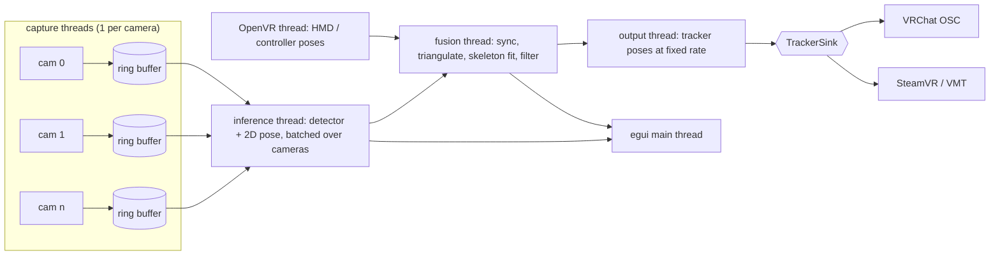

# Optra Design Document

Optra is a multi-webcam lower-body tracking application for VRChat / SteamVR.
It observes the user with 2-4 fixed ceiling-mounted webcams, estimates 2D
keypoints per view with ONNX models, triangulates them into a 3D skeleton in
the SteamVR play-space coordinate frame, and streams virtual tracker poses to
VRChat (OSC Trackers) or to SteamVR (virtual tracker driver).

## 1. Target environment

| Item | Assumption |
|---|---|
| OS | Windows 11 (primary). Linux is not a target for the first release. |
| GPU | AMD or NVIDIA discrete GPU. Inference runs through ONNX Runtime DirectML. |
| HMD | Quest-class 3-point tracking driven by SteamVR. |
| Cameras | 2-4 USB webcams, fixed at ceiling corners, looking down at the user. Models may be mixed freely; see section 6.1. |
| Consumer | VRChat, running under SteamVR. |

Because the cameras never move, extrinsics are solved once per room layout and
reused; only a quick sanity check is needed at each session start.

## 2. Design decisions

These are the decisions that shape everything below.

1. **Output backends are pluggable, both are supported.** A `TrackerSink`
   trait with two implementations: VRChat OSC Trackers (default, no driver
   install) and a SteamVR virtual tracker driver via VMT (OSC-driven,
   MIT-licensed). The user selects the active sink in the UI.
2. **Extrinsics come from the HMD, not from a printed board.** While the user
   walks around the room wearing the headset, Optra records the OpenVR HMD pose
   and the head keypoint detected in each camera image. Those 3D-2D
   correspondences give a full camera resection per view. This puts the camera
   frame and the SteamVR play space into the *same* coordinate system from the
   start, which removes an entire class of alignment bugs.
3. **3-8 trackers, user configurable.** Hips + both feet is the default; chest,
   knees and elbows can be enabled individually.
4. **DirectML only.** One code path that works on AMD and NVIDIA alike. CPU
   execution stays available as a fallback for debugging.
5. **Multi-view triangulation, not per-view 3D regression.** With 2-4 calibrated
   fixed cameras, triangulating 2D keypoints is both more accurate and cheaper
   than running monocular 3D models and fusing their outputs. Monocular 3D
   models are therefore not part of the pipeline.
6. **Cameras are heterogeneous by default.** No stage assumes that two cameras
   share a resolution, field of view, lens model, frame rate, latency or even
   the pose model used to process them. Everything downstream of capture works
   in angular units rather than pixels so that a wide-angle 480p camera and a
   narrow 1080p camera can be combined without one silently dominating the
   other. See section 6.1.

## 3. Technology stack

| Concern | Choice | Notes |
|---|---|---|
| GUI | `eframe` / `egui` 0.36 (wgpu backend) | Mature on Windows, trivial to push camera frames as textures, immediate-mode fits a live dashboard. gpui was rejected: its Windows support is not production-ready. |
| Camera capture | `nokhwa` 0.10 (`input-msmf`) | Media Foundation on Windows, MJPEG and raw formats, per-device format/FPS negotiation. |
| Inference | `ort` 2.0.0-rc.13 (ONNX Runtime 1.28), `directml` feature | Session per model, batched across cameras. |
| Linear algebra | `nalgebra` | Poses, projections, SVD for DLT. |
| Optimization | hand-written Levenberg-Marquardt over `nalgebra` | The parameter set mixes per-camera blocks with a shared rig offset, and expressing that through a solver crate cost more than the sixty lines the solve itself takes. |
| OpenVR | `openvr_api.dll` loaded at run time through `libloading` | See below. |
| OSC | `rosc` | Both output backends speak OSC over UDP. |
| Config | `serde` + `toml` | Room profiles, model manifest, UI settings. |
| Misc | `crossbeam-channel`, `anyhow`, `thiserror`, `tracing`, `ureq`, `sha2`, `rfd` | |

## 4. Coordinate systems

Getting this wrong is the most likely source of silent breakage, so it is
pinned down explicitly.

- **World frame `W`** = OpenVR standing universe. Right-handed, +Y up,
  -Z forward, metres. Everything Optra computes internally lives here.
- **Camera frame `C_i`** = OpenCV convention. +X right, +Y down, +Z into the
  scene. Extrinsics are stored as `T_WC` (camera-to-world).
- **VRChat / Unity frame `U`** = left-handed, +Y up, +Z forward.
  Conversion from `W`: `p_U = (x, y, -z)`, `q_U = (-qx, -qy, qz, qw)`.
  VRChat expects Euler angles in degrees, applied in Z-X-Y order.
- **VMT** accepts either a Unity-convention or a driver-convention address; the
  driver convention (quaternion, right-handed) is used to avoid a lossy Euler
  round-trip.

**The floor is inherited, not measured.** Every position Optra computes is
expressed against the standing universe's floor, and nothing in the pipeline
ever observes the floor itself -- the cameras are solved from headset positions,
not from the room. So if SteamVR's floor is wrong, every camera, every joint and
every tracker is wrong by the same amount, and nothing inside Optra can tell.
The solve stays perfectly self-consistent, the reprojection error stays low, the
reconstructed room looks right, and the feet come out half a metre underground.

Two checks are therefore made against it. The wizard tests the one number that
gives it away up front: a worn headset below about 1.1 m is either a user lying
on the floor or a room setup run with the headset on a desk, and the latter is
the easy mistake. Once tracking runs there is something better -- the cameras
can see the feet, and a foot on the ground *is* the floor, which makes the
reconstruction an independent measurement of the very quantity it inherits.

That measurement is taken from the *raw* reconstruction, never the fitted one:
the fit holds every joint above its own idea of the floor, so measuring its
output would hand back that idea unchanged. It is the tenth percentile of the
lowest foot rather than the median, because a foot the cameras only catch part
of the time is mostly a foot in the air, and not the outright minimum, which is
whichever frame the triangulation was most wrong on.

It reports and does not correct. A floor that disagrees means the room setup is
wrong, and quietly compensating here would leave the user with a working Optra
and a broken SteamVR -- every other application on the machine would still put
them underground.

The same argument applies to the other two axes and is stronger there, because
the headset is a better witness than the ground. See section 9.7: the cameras
have an opinion about where the user's head is and the headset knows, and the
difference between them is the total error of everything in between. The floor
check came first and is the narrower of the two.

Optra also sends `/tracking/trackers/head/{position,rotation}` from the live HMD
pose so VRChat can align its own space to ours instead of relying on the user to
nail the in-game calibration pose.

## 5. Architecture



Threads communicate over bounded `crossbeam` channels. Every stage drops stale
data rather than queueing it: for a real-time tracker, a late frame is worthless.

### 5.0 Timing

Three loops here run at a fixed rate: pose sampling, the fusion clock and the
output thread. Two things stop them holding it, and both were measured rather
than assumed.

Windows wakes sleeping threads on a roughly 15.6 ms tick unless a process asks
for better, so a loop sleeping 8 ms gets 15.6 ms and runs at 64 Hz whatever it
was configured for. Nothing reports this; the loop simply runs at half speed.
Optra raises the timer resolution for the life of the process, which is the
documented approach for an application of this kind and, on Windows 11, applies
to the process rather than the machine.

That alone is not enough. A loop that sleeps for the period at the end of each
pass drifts, because the sleep overshoots a little and the work takes a little
and both accumulate. `worker::timing::Ticker` keeps the *schedule* instead of
the interval: each tick has a deadline, and an overshoot on one is absorbed by a
shorter sleep on the next. A loop that stalls skips the ticks it missed rather
than running them back to back, since catching up on stale work is not what any
of these loops want.

Measured on the development machine, asking for 125 Hz:

| | Achieved |
|---|---|
| Plain sleep, default timer resolution | 64 Hz |
| Plain sleep, raised timer resolution | 120 Hz |
| Ticker, raised timer resolution | 125 Hz |

### 5.1 Module layout

```
src/
  main.rs            app entry, thread supervision
  config/            serde types, room profiles, persistence
  app/               egui UI
    panels/          cameras, models, calibration, tracking, output, log
      notice.rs      warnings that are allowed to change, but not quickly
    viewer3d.rs      skeleton / frusta / play-space renderer
  capture/           capture threads, mailboxes, per-camera statistics
    source/          frame sources and device property sessions
      webcam.rs      Media Foundation capture via nokhwa
      synthetic.rs   the simulated room, for developing without hardware
      controls.rs    exposure, gain and friends through DirectShow
  infer/             ort session management, EP setup, batching, scheduling
    traits.rs        Detector / Pose2d / MultiPose2d, PoseSource
    registry.rs      architecture name -> adapter constructor
    preprocess.rs    letterbox / affine crop / normalization
    arch/            architecture adapters
      yolox.rs, rtdetr.rs, simcc.rs, heatmap.rs, movenet.rs
  models/            manifest + spec parsing, download + sha256 verify,
                     license gate, keypoint layout tables
  geometry/          the camera model and everything solved in terms of it
    lens.rs          radial-tangential and equidistant fisheye distortion
    camera.rs        intrinsics, projection, angular error
    resection.rs     DLT resection with RANSAC, RQ decomposition
    refine.rs        joint LM refinement of all cameras and rig offsets
    triangulate.rs   angular-weighted DLT with outlier rejection
  vr/                the SteamVR link
    api.rs           openvr_api.dll, loaded at run time
  calib/
    recorder.rs      correspondence capture during the walk
    latency.rs       per-camera latency estimation
  fusion/
    align.rs         temporal alignment to a common fusion clock
    fuse.rs          per-joint triangulation with positional uncertainty
    bones.rs         measuring the body the cameras are watching
    fit.rs           bone-length and anatomy constrained fit
    filter.rs        constant-velocity Kalman + One Euro, and prediction
    floor.rs         checking SteamVR's floor against where the feet land
    head.rs          checking the whole room against where the headset is
    shake.rs         how much each stage is moving that a body could not
    settle.rs        holding a joint out until it stops changing its mind
    stage.rs         the fusion thread that runs all of the above
  output/
    pose.rs          joint positions -> tracker position + orientation
    sink.rs          the TrackerSink trait and tracker index assignment
    vrchat.rs        VRChat's OSC tracker input, and the Unity conversion
    vmt.rs           VirtualMotionTracker's virtual SteamVR devices
    stage.rs         the send thread that runs all of the above
  sim/               a simulated room, rendered, with the answer known
    body.rs          anatomy, a walk, and the ground truth it produces
    figure.rs        a surface hung on that body
    mesh.rs          triangles, and the shapes a room and a person need
    room.rs          the room, and where the cameras hang in it
    render.rs        a deterministic software rasteriser, see section 14
```

## 6. Capture

Each camera runs its own thread. On every frame the thread stamps the arrival
time with a monotonic clock, decodes to RGB, and writes into a single-slot
mailbox that the inference thread reads. Older frames are overwritten.

Practical constraints that the UI must surface:

- 4 cameras at 1280x720 MJPEG need roughly 4 x 25 MB/s. USB hubs sharing one
  root controller will drop frames; the UI shows measured vs. requested FPS per
  camera so the user can spot this immediately.
- MJPEG is preferred over raw YUY2 for bandwidth; the extra decode cost is small.
- Rolling shutter and auto-exposure hunting both hurt triangulation. The camera
  panel exposes manual exposure / gain where the driver allows it, and warns
  when exposure time is long enough to cause visible motion blur.

### 6.1 Heterogeneous cameras

Buying four identical webcams is not a requirement, and users will realistically
combine whatever they already own. Mixing is supported, but only because the
following are per-camera properties rather than global constants.

| Property | Where it is handled |
|---|---|
| Resolution, aspect ratio | Capture negotiates per device; the pose stage crops and letterboxes to the model input, so the model never sees the native geometry. |
| Field of view, focal length | Per-camera intrinsics `K`, solved during calibration. |
| Lens model | Per-camera choice of pinhole + radial-tangential, or equidistant fisheye for lenses beyond roughly 120 degrees. |
| Frame rate | The fusion clock interpolates each camera independently; a 30 fps camera simply contributes with a larger interpolation gap, which is reflected in its weight. |
| Latency | Per-camera offset from the calibration cross-correlation. |
| Colour response, exposure behaviour | Absorbed by per-model input normalization; keypoint models are robust to this. |
| Pixel format | Per-camera format negotiation (MJPEG, YUY2, NV12). |
| Pose model | Cameras are assigned a model individually; see section 7. |

Two consequences are worth stating explicitly, because they are the parts that
break if the design assumes uniformity:

**Angular units, not pixels.** A pixel means something different on every
camera. One pixel on a 90-degree 640x480 camera covers roughly six times the
solid angle of one pixel on a 65-degree 1920x1080 camera. Any threshold or
weight expressed in pixels would therefore mis-rank cameras against each other.
Triangulation weights, RANSAC inlier thresholds and reported residuals are all
expressed as angles (milliradians) computed as `pixel_error / focal_length`.

**Per-camera lens model.** A wide-angle or fisheye camera is the natural choice
for a ceiling corner, but its distortion is too strong for the radial model and
too strong for a plain DLT resection to converge from. The calibration solver
selects the lens model per camera, seeds the resection from correspondences near
the image centre where distortion is weakest, and only then opens up the
distortion parameters. Fisheye cameras use the equidistant projection with four
coefficients.

Optional refinement, only if measurements show it matters: a per-camera rolling
shutter readout time, applied as a keypoint-row-dependent addition to that
camera's latency offset. Mixing a global-shutter camera with rolling-shutter
ones makes this asymmetry visible during fast leg motion.

### 6.2 Device properties

Exposure is not a nicety, it is a precondition. A webcam left on automatic
exposure lengthens its shutter in dim light until it can no longer deliver the
frame rate it advertises, and smears anything that moves across the frame. Both
are fatal here: the frame rate halves exactly when the room lighting is typical
of a VR setup, and motion blur destroys the keypoint precision that
triangulation depends on.

This is measured, not assumed. The Logitech C920 used during development sits at
15.0 fps at 1280x720 on automatic exposure and 30.1 fps with the shutter pinned
to 1/64 s, in the same room and same lighting.

Optra therefore controls device properties directly through the DirectShow
property interfaces (`IAMCameraControl`, `IAMVideoProcAmp`) on a media source it
opens alongside the streaming one. This is not what nokhwa does: its setter
reuses whatever automatic/manual flag a property currently carries, so writing a
value to a property that is in automatic mode is accepted and then ignored by
the driver. Switching the flag is the entire point, so that path is bypassed.

Properties are applied before the stream opens, so the first frames are already
correct, and can be changed live while streaming, which is what makes adjusting
a slider against the preview possible. The camera panel offers a "fit frame
rate" action that pins the shutter just below one frame period, since that is
the setting nearly every mounted camera wants.

Per-camera property values live in the camera's configuration and are reapplied
on every open, because Windows resets them when the device is reopened.

## 7. Inference

Two-stage top-down pipeline:

1. **Person detection** per camera. Runs at a reduced rate (e.g. every 5th
   frame) because the subject is a single slowly-moving person; between
   detections the previous keypoints expand into a tracking box.
2. **2D keypoint estimation** on the cropped person region, one crop per camera,
   batched into a single ONNX run so the GPU sees one call per stage per frame.

Each camera is assigned its own detector and pose model. A camera with a clear
view of the legs can run the accurate model while a poorly placed one runs a
cheap model, and a low-frame-rate camera can be given a longer inference stride.
Batching then groups cameras by model rather than assuming a single batch: the
inference thread issues one run per distinct model per tick, with a batch
dimension covering the cameras sharing that model. In the common case where all
cameras use the same model this collapses to exactly one run per stage.

The person of interest is disambiguated by projecting the HMD position into each
camera and picking the detection whose head keypoint is closest. This handles
bystanders and mirrors without any extra tracking machinery.

### 7.1 Model abstraction

Models are expected to be replaced over the lifetime of the project, and the
pipeline is built so that swapping one is a configuration change rather than a
code change. Three layers separate the model zoo from the rest of Optra.

**Layer 1: semantic traits.** The pipeline only knows two capabilities.

```rust
pub trait Detector: Send {
    fn detect(&mut self, batch: &[ImageView]) -> Result<Vec<Vec<Detection>>>;
}

pub trait Pose2d: Send {
    /// Keypoints in the coordinate frame of the source image, already mapped
    /// to the canonical skeleton.
    fn estimate(&mut self, batch: &[Crop]) -> Result<Vec<Keypoints2d>>;
}
```

A third form covers single-stage models that produce keypoints directly from a
full frame, so the pipeline is described as a source rather than a fixed pair of
stages:

```rust
pub enum PoseSource {
    TwoStage { detector: Box<dyn Detector>, pose: Box<dyn Pose2d> },
    EndToEnd { model: Box<dyn MultiPose2d> },
}
```

Everything downstream of `infer/` consumes `Keypoints2d` in canonical form and
has no knowledge of which architecture produced it.

**Layer 2: architecture adapters.** Each adapter implements one family's
pre-processing and decoding: input layout and normalization, letterbox policy,
ONNX input/output binding, and the decoder. The initial set:

| Adapter | Covers | Decoder |
|---|---|---|
| `mmdet_end2end` | Detectors exported by mmdeploy, including the YOLOX family | None: the graph emits boxes that have already been through NMS |
| `simcc` | RTMPose family | SimCC 1D classification per axis |
| `heatmap` | ViTPose, HRNet-style top-down models | Argmax + quadratic sub-pixel refinement |
| `movenet` | MoveNet single and multi pose | Centre/offset field decode |
| `yolox_raw` | YOLOX exported without postprocessing | Anchor-free grid decode + NMS |

The first two are implemented; the rest are the shapes the interface was drawn
to fit.

Adapters are registered by name:

```rust
registry.register("simcc", |spec, session| Ok(Box::new(SimccPose::new(spec, session)?)));
```

**Layer 3: declarative model specs.** Everything that varies *within* an
architecture lives in the manifest, not in code: input size, normalization,
tensor names, class indices, decoder parameters, keypoint layout. Adding a new
checkpoint, a new input resolution or a new quantization of a supported
architecture is a manifest entry and nothing else. Adding a genuinely new
architecture is one adapter file plus one registry line.

This also means a user can point Optra at their own ONNX file: a manifest entry
with a local path and a matching `arch` is enough, with no rebuild.

### 7.2 Model catalogue

Models are restricted to Apache-2.0 or MIT upstream licenses, enforced at load
time. Notably this excludes the YOLOv9-based Wholebody detectors, whose upstream
is GPL-3.0.

The models were surveyed in
[PINTO_model_zoo](https://github.com/PINTO0309/PINTO_model_zoo), but they are
fetched from their upstream publishers instead of from the zoo. The zoo
distributes every conversion of a model in a single archive: 0.8 GB for YOLOX
tiny, 3.7 GB for RTMPose WholeBody. Downloading gigabytes to extract one ONNX
file is not a reasonable thing to ask, so each catalogue entry records its zoo
entry in a `zoo` field and points its download at the publisher. A `tar_gz`
source is supported, so any zoo archive can still be used by adding an entry to
the user manifest.

Shipped catalogue:

| Model | Kind | Upstream | Why |
|---|---|---|---|
| YOLOX-tiny (HumanArt) | Detector | Megvii YOLOX, Apache-2.0 | **Default.** Person-only detection with NMS inside the graph. A ceiling camera sees one slowly moving person, so detection is not the bottleneck. |
| YOLOX-s (HumanArt) | Detector | Megvii YOLOX, Apache-2.0 | More robust on steep views and partial occlusion, at roughly twice the cost. |
| RTMPose-m (Halpe 26) | 2D pose | MMPose, Apache-2.0 | **Default.** 26 keypoints including heels and toes. |
| RTMPose-t (Halpe 26) | 2D pose | MMPose, Apache-2.0 | The same keypoints at a quarter of the size, for four-camera setups. |
| RTMPose-m (COCO-WholeBody 133) | 2D pose | MMPose, Apache-2.0 | Whole-body keypoints, kept for comparison. |

The default pose model is Halpe 26 rather than the 133-point whole-body model:
both carry the heel and toe points that foot orientation needs, and the extra
107 face and hand keypoints cost inference time that lower-body tracking never
reads.

Every entry's upstream license is verified when it is added, and recorded in the
manifest:

```toml
manifest_version = 1

[[model]]
id          = "rtmpose-m-wholebody-256x192"
kind        = "pose2d"          # detector | pose2d | multipose2d
arch        = "simcc"           # selects the architecture adapter
zoo         = "393_RTMPose_WholeBody"
source      = { url = "https://.../rtmpose_m_wholebody_256x192.onnx", sha256 = "..." }
license     = "Apache-2.0"
license_url = "https://github.com/open-mmlab/mmpose/blob/main/LICENSE"

[model.input]
name      = "input"
layout    = "NCHW"
width     = 192
height    = 256
color     = "RGB"
mean      = [123.675, 116.28, 103.53]
std       = [58.395, 57.12, 57.375]
resize    = "affine_crop"       # letterbox | stretch | affine_crop

[model.output]
tensors   = ["simcc_x", "simcc_y"]
keypoints = "coco_wholebody_133"

[model.decoder]                 # free-form, interpreted by the adapter
split_ratio = 2.0
```

At load time the declared tensor names, ranks and static dimensions are checked
against the actual ONNX graph, and a mismatch produces a specific error naming
the offending tensor rather than a wrong-looking skeleton at runtime.

Models are not vendored in the repository. The UI downloads them on demand,
verifies the SHA-256, and displays the license before enabling a model.

### 7.3 Keypoint abstraction

Different models emit different keypoint sets (COCO-17, COCO-WholeBody-133,
MoveNet-17). Postprocessing maps each into an internal canonical skeleton
(hips, knees, ankles, heels, toes, spine, shoulders, elbows, head) with a
per-joint validity flag, so nothing downstream of `infer/` knows which model
produced the data.

The layouts themselves are data, not code. `keypoints.toml` names each layout
and lists the source index for every canonical joint, so a model with an
unfamiliar keypoint ordering is supported by adding a table:

```toml
[coco_wholebody_133]
left_ankle  = 15
right_ankle = 16
left_heel   = 20
left_toe    = 17
# ...
```

Canonical joints with no source index are simply absent, and the fusion stage
already handles absent joints. This is what allows a 17-keypoint model and a
133-keypoint model to run on different cameras in the same session: each
contributes the joints it can, and the skeleton fit resolves the rest.

### 7.4 Swapping models at runtime

Sessions are owned by the inference thread, so a swap is a message rather than a
lock. The thread receives a swap request, builds and warms up the new session on
a background thread, then replaces the old one between ticks and drops it. The
UI stays responsive and tracking continues on the old model until the new one is
ready, which matters because building a DirectML session takes on the order of a
second.

Because model assignment is per camera, a swap can also target a single camera,
which makes side-by-side comparison in a real room straightforward: run the
candidate on one camera, keep the incumbent on the others, and read off the
angular residuals from section 9.2.

## 8. Calibration

### 8.0 The SteamVR link

Every published OpenVR binding builds the SDK from source with CMake and links
it statically. Neither half of that suits Optra. A C++ toolchain in the way of
anyone compiling it is a cost with no return, and a statically linked runtime
means the program refuses to start on a machine without SteamVR — while setting
cameras up without a headset present is something people will do, and the first
thing a new user does.

`openvr_api.dll` is therefore located and loaded when it is needed, and its
absence is a line in the UI rather than a failure to launch. The UI
distinguishes "no runtime on this machine" from "SteamVR is not running",
because those are different problems with different fixes. Optra registers as a
background application, which means it never starts SteamVR on its own; when
the server is down the runtime refuses the connection and the link keeps
retrying.

The function table is transcribed from `openvr_capi.h`, and only as far as the
last entry Optra calls — the runtime's table continues past that and nothing
reads it. Entries before that point which are never called are still declared,
as opaque pointers, because their *position* is what identifies the ones that
are. Two unit tests guard the transcription by asserting the size of the pose
struct and the length of the table; getting either wrong would have the runtime
write past the end of an array.

Poses are sampled on their own thread at 120 Hz into a few seconds of history,
and consumers ask for a pose *at a time* rather than for the latest one. A
webcam frame and a pose sample never land on the same instant, and pairing them
as though they did is worth several centimetres during a walk. Instants outside
the recorded window return nothing rather than an extrapolation.

SteamVR does not report its own exit through this interface, so the headset
ceasing to be connected for a few seconds is what triggers dropping the runtime
and looking for it again.

The connection is a *process* singleton, not a handle. `VR_InitInternal` and
`VR_ShutdownInternal` act on the process, so a second connection shares the
first one's state and whichever is dropped first invalidates the function table
both are holding; the survivor then calls through a dangling pointer. Optra
therefore refuses a second connection outright, and the refusal releases its
flag so that a link retrying while SteamVR is down still recovers when it comes
back up.

### 8.1 What is solved

Per camera: intrinsics `K` (fx, fy, cx, cy), distortion coefficients under that
camera's lens model, extrinsics `T_WC`, and a scalar latency offset. Globally:
the constant offset between the HMD origin and the detected head keypoint,
expressed in the HMD's own frame.

The lens model is per camera: radial-tangential (k1, k2, p1, p2) for ordinary
lenses, equidistant fisheye (k1..k4) for wide ones. The initial focal guess
comes from the field of view the device reports, or from a user-entered value
when the driver reports nothing useful; the solver only needs it to be within
roughly a factor of two.

### 8.2 Procedure

1. The user starts the calibration wizard and walks slowly around the room,
   covering as much floor area and height variation as possible (standing,
   crouching, arms raised).
2. Optra records tuples of `(HMD pose in W, head keypoint in image i, timestamp)`
   plus the same for controllers against wrist keypoints, which adds spread away
   from the head's narrow height band. The pose is taken at the instant the
   frame was *captured*, interpolated between the samples either side of it,
   not the latest pose at the moment the keypoints came out of inference —
   those are tens of milliseconds apart and that is centimetres of error.

   A **rig** is a device paired with a specific keypoint, not a device alone.
   "The head keypoint" is not one point: a Halpe model reports a head centre
   and a COCO model reports the nose, and those are several centimetres apart,
   so two cameras running different models need two offsets. The rig set is
   discovered during the walk rather than fixed in advance, and a rig that only
   appears halfway through still receives the device track from before it
   appeared — its keypoint may simply have been out of frame.

   Three things are dropped rather than recorded. Keypoints below a confidence
   threshold. Keypoints outside the frame, because a pose model asked about a
   person half out of shot will place one there and that is the model guessing
   rather than the camera seeing. And samples where the keypoint has barely
   moved since the last one kept: a user standing still otherwise contributes
   hundreds of near-identical rows that weight the solve toward one spot and
   constrain nothing.

   Coverage is counted per camera on a grid over its frame, and the whole
   device track is kept rather than collapsed into one pose per sample —
   estimating a camera's latency means asking where the headset was at a range
   of shifted times, which a track that has already been sampled away cannot
   answer.
3. Initial per-camera solve: DLT resection from at least 6 well-spread
   correspondences yields the full projection matrix `P`, decomposed by RQ into
   `K`, `R`, `t`. RANSAC rejects frames with bad detections. For strongly
   distorted lenses the resection is seeded from central correspondences only,
   and the straighten-and-solve step is iterated, because straightening the
   pixels needs the intrinsics the solve is producing.

   The head keypoint offset is still unknown at this point, so every
   correspondence carries the same few centimetres of error. The resection
   inlier threshold has to be loose enough to absorb it — around 0.08 rad —
   or the whole walk is discarded as outliers. Bad detections are still an
   order of magnitude further out than that.

   The solve also reports how far the correspondences are from lying in a
   plane. A walk that never changes height is degenerate for the DLT, and that
   has to be reported rather than returned as a confident wrong camera.
4. Joint refinement: Levenberg-Marquardt over all cameras minimizing angular
   reprojection error, with the HMD-to-head-keypoint offset shared across
   cameras and each camera's distortion coefficients free. The residual is
   angular rather than pixel-based so that a high-resolution camera does not
   dominate the objective purely by having smaller pixels.

   The refinement runs twice. A Huber weight bounds how far a bad keypoint can
   pull the first pass, but bounded influence is not no influence, and a walk
   of several hundred frames carries enough missed keypoints for the remainder
   to matter. The second pass discards the sightings the first left behind and
   fits the rest cleanly, starting again from the seed rather than from the
   first pass, whose answer was shaped by the very data being dropped.
5. The wizard reports RMS angular reprojection error per camera and a per-camera
   coverage heat map, and refuses to save a profile above a configurable
   threshold. Coverage is tracked per camera rather than globally: a narrow-FOV
   camera sees a smaller slice of the room, so a walk that satisfies a wide
   camera can leave a narrow one under-constrained. The wizard directs the user
   toward the areas that are still thin for a specific camera.

The head keypoint offset is observable precisely because the HMD *rotates*
during the walk: a constant offset in HMD frame traces a different world path
than the HMD origin, and that difference is what the solver keys on. If the user
walks without ever turning their head, the wizard detects the degenerate
configuration and asks for more rotation variety.

**Rotating is not enough; rotating about more than one axis is what is needed.**
Moving every camera by some `d` leaves every reprojection untouched provided the
offset can absorb it, which requires `Rᵢᵀ d` to be the same at every sample —
that is, `d` has to be a common fixed axis of the rotations. A user walking a
room looks left and right and hardly at all up and down, so the yaw axis is
exactly such an axis, and the entire room is free to slide vertically against
the head offset. Nothing in the residual objects.

The test for it is the **largest** singular value of the mean rotation matrix,
not the smallest. Averaging unit vectors `Rᵢᵀ d` returns something of unit length
only when they were all equal, so `σ_max = 1` is precisely the degenerate case.
This was originally written as `1 - σ_min`, which asks whether *some* direction
is constrained rather than whether *every* direction is: it sees the yaw
averaging away and reports an excellent walk. The synthetic walks never caught
it because the simulated user obligingly nods. The value reported is
`sqrt(1 - σ_max²)`, the fraction of a unit shift the offset cannot absorb, which
is roughly the radians of rotation the walk varied by in its worst direction.

Detection is the guidance, not the guarantee. The solver also bounds each rig
offset to a quarter of a metre — a headset does not sit half a metre from the
head it is strapped to, and a hand does not hold a controller at arm's length.
It is a bound rather than a prior: it does nothing at all while the answer is
plausible, and turns an unbounded error into a bounded one when the walk left a
direction free. It is applied to the accepted iterate rather than inside the
step, so the Jacobian still differentiates the function it thinks it does.

### 8.3 Latency estimation

USB webcams have tens of milliseconds of unmodelled delay, and it differs per
device — a cheap camera and a good one in the same room are not looking at the
same instant. Nothing reports the number, so it has to be measured, and the
walk already recorded for the extrinsics is enough to do it.

The measurement is a search rather than a correlation. For a range of candidate
delays, the recorded device track is sampled that far *back* from each frame's
timestamp, reprojected through the solved camera, and the delay that explains
the pixels best wins; a parabola through the winner and its neighbours puts the
answer between the two-millisecond grid points. That is the same objective the
bundle refinement minimizes, scanned over a time shift, so it reuses the
geometry instead of introducing a separate notion of similarity.

It therefore has to happen *after* the first refinement, since it needs cameras
to reproject through. Once the delays are known the room is solved again against
the corrected timestamps, which is what turns the measurement into accuracy
rather than a number on a screen.

**Solved again, and more than once.** Both halves of that were wrong at first,
and neither could be seen until a recording carried a delay — every synthetic
recording had been prompt, which is the one thing no real camera is.

The first pass has no delays to work with, so it does the only thing it can and
puts each camera wherever best explains a walk it believes happened forty
milliseconds after it did. Part of every delay is therefore already hidden in
the extrinsics by the time the search runs, and the search finds only what is
left: a camera really ninety milliseconds late came back as fifty-two. Solving
again exposes the rest, so the measurement and the fit alternate until a round
changes nothing, which takes two.

The second half is worse. Correcting only the *pairings* and refining from the
original resection leaves the refinement starting from a seed seeded against a
walk that camera had not caught up with — and a seed that far out is not one the
refinement pulls back. Its outlier rejection throws away the sightings that
disagree with the seed instead, so the camera ends up solved from a quarter of
its own data. In the test that found this, a camera forty milliseconds late kept
51 of its 190 sightings and came out 39 cm from where it was, while every other
camera in the room was fine. Both the resection and the pairing are redone.

With both fixed, a room whose four cameras are 0, 20, 40 and 90 ms late is
recovered to 5 mm and every delay to within half a millisecond. Ignoring the
delays puts a camera nine metres away — which is not a degraded calibration but
a different room, and it is the calibration every real installation would have
had.

**Seeding a camera that is too late to resect.** That test picked its delays
inside a range that happened to work, and sweeping past it found the range was
narrow. A camera much more than sixty milliseconds late does not resect at all:
its pixels, paired with poses from sixty milliseconds after the shutter, agree
with no camera, and the search ends with no consensus rather than with a bad
answer. Three of the four cameras in the test room failed at eighty
milliseconds and all four at a hundred and ten — inside the range this same
code calls plausible for a webcam — and the failure ended the whole calibration
*before* the estimator ran, on a message about correspondences.

The chicken and egg has an easy way out, because the resection is a sharp
detector of its own delay: it fails outright at zero, twenty, forty and sixty
and comes back clean at eighty with three tenths of a degree on it. So the seed
searches a twenty-millisecond grid when the delay it was handed does not solve,
keeps the candidate with the most inliers, and carries that lag back out — the
sightings have to be paired at it too, or the pairing undoes the only thing that
worked. Every camera from forty to a hundred and twenty milliseconds now solves
within half a millimetre, and four cameras all seventy milliseconds late, which
is what a room furnished with one model of webcam looks like, come out within
nine.

**Refusing a room that did not solve.** The same sweep found the other half:
a camera can be solved to nonsense and not look like it. The refinement's
outlier rejection throws away everything that disagreed with wherever the
camera ended up, so what comes back is a handful of sightings with a small error
over them — an `Ok`, a saved profile, and feet a metre out. One camera kept 5
of its 175 sightings, came out 36° from them, and stood two and a half metres
from where it hangs; another kept 2 of 189 at 81°.

Two gates, at the end of the solve. The first is that arithmetic: a camera
keeping under a quarter of its sightings, or landing more than three degrees
from the ones it kept, did not solve. The populations are four orders of
magnitude apart, so the thresholds are loose.

The second is subtler and is the one the delay handling always needed. A timing
error moves every sighting the same way, so the fit stays perfectly
self-consistent about a camera in the wrong place, and no reprojection residual
can see it — ten milliseconds of it was half a metre. What does see it is the
delay the room was *fitted* at against the delay measured on it. Those agree
exactly when the alternation converges, and disagree only when something
declined to close the loop: an estimate too long to apply, a loop out of rounds,
a seed that had to guess. The gap is then the size of the error left behind.

Plausibility was tried for this first and is the wrong test. A delay of exactly
a hundred and twenty milliseconds is not plausible by that definition and solves
to a tenth of a millimetre. What matters is not whether the number is large but
whether the room was fitted at it.

A delay is invisible against a stationary head, so each estimate carries how
much worse the fit gets a probe distance either side of the answer,
**measured in pixels** rather than as a fraction of the best fit. The relative
form is unusable: a nearly exact fit makes any ratio enormous, so a user who
stood still would be reported as the most confident result of all. Below about
a pixel the rise is indistinguishable from keypoint noise, and the estimate is
shown but not applied — a delay guessed from a flat curve is worse than no
delay at all.

## 9. Fusion

### 9.1 Temporal alignment

The fusion thread runs on a fixed virtual clock (default 60 Hz). For each tick
at time `t`, each camera's 2D keypoints are linearly interpolated between its
two samples that bracket `t - latency_i`. Cameras with no bracketing samples are
skipped for that tick rather than extrapolated.

Bracketing means the tick has to sit *behind* real time, since a frame after it
does not exist yet. That lag is not a loss: the prediction step in 9.4 already
has to compensate for a delay several times larger, and it is far better to
predict forward from a properly aligned reconstruction than to fuse rays taken
at three different instants.

**How far behind is measured, not configured.** The first version set it from
the largest camera latency the calibration had measured plus a fixed margin,
worked out once before any camera had delivered anything, and it left out the
term that dominates: the time from a camera grabbing a frame to that frame's
keypoints existing. That is the model, the resolution and whatever else is on
the GPU — on a three-camera setup running a heavy pose model it was nearly two
hundred milliseconds, against a forty-millisecond margin. So each tick measures
how stale every camera's newest frame actually is, keeps the worst of the recent
past with a four-second half-life, and sits behind whichever camera needs the
most. Rising is instant and falling is slow: tightening onto one lucky moment
would drop everybody out on the next ordinary one.

**A camera is either waited for or it is not.** This is the part that matters,
and the reason the paragraph above is not a small tuning note. A camera the
clock does not wait for does not degrade gracefully — it has a bracketing pair
on some ticks and not on others, so it drops in and out of the reconstruction,
and a joint reconstructed from a different set of cameras every few ticks moves
by the disagreement between them each time the set changes. That disagreement is
the calibration error. It is centimetres, it arrives as a square wave between
two different right answers rather than as noise, and no filter downstream can
take it out. The panel had been reporting it all along as alignment fractions of
forty-four to seventy-nine per cent; nothing read those as a fault.

Waiting has to stop somewhere, and where it stops is a decision rather than a
flicker. A camera past the ceiling is left out of the reconstruction entirely
and says why in the Tracking panel, which is at least something a user can act
on — move it, give it a lighter model, or raise the ceiling and accept a later
body. The two least late cameras are always waited for however late they are:
triangulation needs two, and the alternative to waiting is not a faster body but
an empty room. Both directions take two seconds of agreeing before they happen,
so a hiccup costs nothing.

The clock may slow but never runs backwards. A reconstruction stamped before the
last one hands every stage after it a negative time step, so a growing lag is
taken up at half a tick per tick — the clock falls behind at half speed until it
has covered the new delay, which takes a fraction of a second.

A joint present in only one of the two bracketing frames — which happens
whenever a limb crosses the pose model's confidence threshold — is taken from
the frame that has it rather than dropped. Dropping it would cost a camera its
vote on exactly the joints the other cameras are also struggling with; taking it
is a position held rather than interpolated, and the weight below charges it for
the difference.

### 9.2 Triangulation

For each canonical joint:

- Collect rays from cameras whose keypoint confidence exceeds a threshold.
- Fewer than 2 rays: mark the joint unobserved and let the filter coast.
- 2 rays: weighted linear DLT.
- 3+ rays: RANSAC over view subsets to drop views where the joint is occluded or
  mis-detected, then non-linear refinement minimizing angular reprojection
  error.

Weights are the inverse variance of each ray's *direction*, not the raw
keypoint confidence. For camera `i` the angular uncertainty is

```
sigma_i = (sigma_px(conf_i) / f_i) * interp_penalty_i
```

where `sigma_px` is the keypoint localization noise implied by the confidence
score, `f_i` is that camera's focal length in pixels, and `interp_penalty_i`
charges the ray for not having been observed:

```
interp_penalty = 1 + drift_px / sigma_px(conf)
```

Expressing the drift against the keypoint noise is what makes the number mean
something: below that noise the interpolation is not what limits the answer, and
equal to it the ray counts for a quarter of an observed one.

The drift itself depends on which case produced the sample. Straight-line
interpolation is *exact* for a joint moving at a constant speed, so charging it
`speed × gap` — the error of holding the previous sample — would penalise every
camera for motion that costs nothing. What it is actually wrong by is whatever
the joint did besides moving steadily, and two frames cannot measure that. What
they bound is how much it could be: a foot can reverse within one frame
interval, putting the acceleration at around a speed per bracket, which gives

```
drift_px = speed × gap × (bracket - gap) / bracket
```

This vanishes at both ends of the bracket, peaks in the middle, and grows with
how long the camera left the clock waiting — so a 30 fps camera loses influence
during a step and regains it between them, without being switched off. A joint
taken from only one of the two frames is a hold rather than a blend, and pays
the first-order `speed × reach`; lacking a second sample of its own, its speed
comes from the joints the two frames do share.

The weaker of the two ends sets an interpolated joint's confidence. A joint the
model was sure of in one frame and unsure of in the next is not half-sure in
between — the interpolation is only as sound as the shakier observation holding
it up.

This is the piece that makes mixed hardware behave. Confidence scores are not
comparable across models, and a pixel is not comparable across cameras; dividing
by focal length converts both into the same physical quantity, so a 1080p narrow
camera correctly outvotes a 480p fisheye on the same joint, and a 30 fps camera
correctly loses influence during fast motion without being switched off. The
RANSAC inlier threshold is likewise angular, so it means the same thing on every
camera.

The linear solve is a seed, not the answer. It minimizes an algebraic quantity
that vanishes at the right point but is biased towards the nearest cameras away
from it, so the result is refined against the objective it is actually judged by:
the weighted perpendicular distance to each ray, in metres. Each ray's weight
there is `1 / (sigma_i × range_i)²` — an angle is not a distance until it is
multiplied by one, and the same half-degree is a millimetre up close and a
centimetre across the room. Three passes are enough, since only the ranges
change between them.

That refinement produces the number this stage is really for. Inverting its
normal matrix gives the position covariance in square metres, and the square
root of its largest eigenvalue is how far the joint could be wrong along the
direction the cameras constrain least. **This is the half of "can this joint be
believed" that the reprojection residual cannot answer; two paragraphs down is
the half only the residual can.** Two cameras a hand's width apart agree with
each other perfectly about a point neither of them can place along the line of
sight: the residual reports zero error and the uncertainty reports a
third of a metre. A joint whose uncertainty exceeds a threshold is withheld
rather than reported, because passing it on would only give the filter something
confident to smooth. The claim is checked rather than asserted — a unit test
injects noise of the size the model assumes and confirms the spread of the
answers matches what was predicted.

That covariance is a prediction of the error, though, never a measurement of
one. It is built entirely from the noise each ray *claimed*, by way of the
keypoint confidence the pose model attached to it, and it is wrong in a specific
and damaging direction: three well spread rays pin a point down beautifully
whether or not the cameras they came from agree about where anything is. A room
calibrated to three centimetres therefore reported joints good to five
millimetres. Everything downstream believed it — the filter weighted the
measurement by that number and followed the disagreement as fast as it could,
the panels printed it and told the user their cameras were excellent, and the
two limits that exist to withhold a joint nothing can place never fired, because
nothing ever came near them.

The residuals are the missing measurement, and were computed, printed in degrees
on a panel, and never once allowed to say anything about the answer. Scaling the
covariance by the ratio of the two is the standard *a posteriori* variance
factor of a least-squares adjustment:

```
factor = sum_i (residual_i / sigma_i)^2 / (2n - 3)
sigma_reported = sigma_covariance * sqrt(max(1, factor))
```

Two constraints per ray and three unknowns in the point, hence the degrees of
freedom. The factor is pooled over the whole body rather than computed per
joint: per joint there is one degree of freedom with two rays and three with
three, and the variance of such an estimate is as large as the estimate itself,
which would swing the filter's gain about at random — a second source of shaking
introduced by the fix for the first. Pooling is also the truer model, since how
far apart two cameras think the room is is a property of the room and not of a
knee. Joints whose own ratio exceeds twenty-five are left out of the pool: past
five sigma a residual is a keypoint on the wrong limb that the inlier test let
through, not evidence about the calibration. The factor is floored at one,
because rays that agree better than they claimed to have been lucky rather than
accurate, and a body's worth of joints is far too small a sample to conclude
otherwise from.

The factor is worth reporting on its own, and the Tracking panel does. It is
measured continuously, from the user rather than from a checkerboard, and it is
the only thing in the application that can notice a camera has been knocked
since it was solved.

**A joint that is not reconstructed says which of five things went wrong.**
Nothing offered a keypoint; something did and none of it cleared the confidence
gate, with the best confidence any camera managed carried alongside; only one
ray arrived, which fixes a direction and nothing else; the geometry could not be
solved from any subset; or it was solved and thrown away for being too
uncertain. These are five unrelated problems with five different next moves —
move a camera, lower the gate, add a camera that can see the joint, recalibrate,
move the cameras apart — and the panel showed one dash for all of them.
"Twenty-three of twenty-six joints inferred" says something is badly wrong and
nothing about what. A sixth entry sits beside them, for joints held back rather
than faulty; it is described at the end of this section.

Writing the test for that turned up something worth stating plainly: **two rays
can never disagree.** Two skew lines always have a nearest point, so a badly
calibrated pair does not fail — the point simply moves, confidently, to
somewhere the joint is not. The only thing standing between a user and that is
the uncertainty above. Disagreement is detectable from three rays up, and even
then the usual outcome is that the odd ray is dropped and the joint reported
without it. It is the argument for a third camera stated precisely: the second
camera buys a position and the third buys the ability to know it is wrong.

**Where the cameras are is a separate question from how well they were solved,
and it is asked separately.** A calibration can be flawless and still describe
cameras clustered in one corner all looking the same way: they agree with each
other beautifully about a point none of them can place along their shared line
of sight, and the residual cannot see it. So the wizard also reports what the
geometry alone allows -- a keypoint of ordinary quality is placed at each point
the person stood, triangulated through the solved cameras, and the resulting
uncertainty reported. That is the number a user moving a tripod needs, and it is
the residual that would mislead them.

Per-joint angular residuals and uncertainties are retained and surfaced in the
UI, together with each camera's contribution weight and the cameras that were
dropped as outliers; this is the single most useful diagnostic when tracking
misbehaves, and it is what tells a user that one camera is mis-calibrated or
badly placed.

Joints are solved independently of one another, which is deliberate. A joint
hidden from two of three cameras is a bad joint, not a bad pose, and letting it
drag the rest of the body with it is the failure that makes multi-camera
tracking feel worse than single-camera tracking. What holds the body together is
the skeleton fit below, which knows about anatomy; this stage knows only about
rays.

**Every one of those tests is a threshold on a quantity that moves between
ticks, so a joint sitting on one does not settle on an answer.** It passes,
fails, passes, fails, at the tick rate. That would be harmless if the two
outcomes were near each other and they are not: a joint that is reconstructed
sits where the cameras put it, and a joint that is not is invented by the fit,
from the skeleton, wherever the bones say it has to be. The distance between
those two answers is the calibration error — centimetres in a good room, and
seventeen of them in the report that prompted this. So the joint does not
degrade when it flips. It teleports, sixty times a second, between two positions
that are each defensible, and nothing downstream removes that: it is a square
wave whose amplitude is a real disagreement, not noise around a true value.

This is the failure of section 9.1 one level down. There it was a camera
dropping in and out of ticks changing which cameras a joint was built from; here
it is a joint dropping in and out of the body. The answer is the same shape:
decide, and then hold the decision. A joint that fails goes out at once, because
there is nothing else available — the reconstruction genuinely has no position
for it — but coming back takes a run of consecutive ticks that all agree, six by
default, a tenth of a second at sixty hertz. Counted in ticks rather than
milliseconds because what it guards against is alternation from one tick to the
next.

The cost is that a joint the cameras can only solve half the time stays
inferred, and that is the right trade. An inferred joint is smooth and
anatomically possible and may be in the wrong place; an alternating one is in
the wrong place half the time *and* unusable the rest. A joint starts admitted,
so acquiring the body at startup costs nothing — the dwell exists to stop a
joint coming *back* too eagerly, and there is nothing to come back from until
something has gone out.

Held-back joints are counted on the panel as their own reason, beside the four
faults. They are the one entry there that is not a complaint about the room, and
a count that stays high is worth its own diagnosis: it says the thresholds are
being sat on, and therefore that every other figure on the panel is describing a
body that keeps changing which joints it is made of.

### 9.3 Skeleton fit

Raw triangulated joints jitter and violate anatomy. A constrained fit enforces
fixed bone lengths, keeps joints above the floor plane, and limits knee
hyperextension. Unobserved joints are filled by the constraint solver rather
than by the last raw value.

This is not smoothing, and the distinction is the whole point. Smoothing trades
lag for jitter and treats every direction alike. The fit removes only the part
of the error that is physically impossible — a shin that grew four centimetres,
a foot below the floor, a leg folded backwards — which is roughly half of it,
and costs no lag at all. Filtering (9.4) then works on what is left.

The solver is sequential projection: each constraint is satisfied in turn, over
about a dozen passes, with each joint moving in inverse proportion to the square
of its positional uncertainty. That weighting is what separates a fit that
cleans up the uncertain joints from one that drags the certain ones around: a
joint located to five millimetres barely moves, one located to five centimetres
gives way, one nobody saw goes wherever the constraints put it. The floor is
enforced last, so it is the constraint that comes out exactly satisfied — a foot
a centimetre underground is the most visible failure there is in VR.

A knee is kept from ending up behind the line between its hip and ankle, with
the body's facing taken from the line across its hips. This is not a theoretical
limit: from behind, a knee and the space in front of it look much alike, and a
pose model asked which way the leg folds will sometimes answer wrongly. Left
alone the leg snaps between two mirror-image bends as the user turns. The knee
is reflected across the line rather than flattened onto it, because the amount
of bend was never in doubt — only its direction.

A joint that goes out of sight is seeded from its previous fitted position and
then moved by the constraints, so it is continuous without being frozen. A joint
that was *never* seen stays absent: there is no honest place to put it.

A bone whose measurement never settled is not enforced, and neither is anything
in an unmeasured skeleton — the fit passes the reconstruction through rather
than inventing anatomy. When the measured skeleton and the cameras disagree
badly, the fit reports how far it had to drag the worst joint instead of quietly
resolving the disagreement in the skeleton's favour. Reverting individual joints
was tried and rejected: a body where some joints are fitted and others are not
satisfies nothing, and it is the *pose* that is wrong, not the joint.

The lengths are measured rather than assumed. A table of average proportions
would be wrong for most people by more than the error being chased, and the
cameras are already producing the measurement for free — a shin that reads 41 cm
one frame and 46 cm the next is reporting keypoint noise, and the median of a
few hundred such readings is the leg.

A median, specifically, and not a mean: a pose model that occasionally puts a
knee on the other leg produces samples wrong by tens of centimetres, and a mean
carries every one of them. The spread is likewise a median absolute deviation,
which is what says whether a length ever settled — a bone measured from joints
that were themselves uncertain has a number, and holding the body to it would be
worse than holding it to nothing.

Both sides of the body pool their samples into one length. People are symmetric
to within a couple of percent, so a leg the cameras half-see borrows the
measurement of the leg they see well, and neither side can drift into its own
private anatomy.

Two things here differ from what this document originally specified, both
deliberately:

- **No rescaling against the headset's floor height.** The room was solved from
  headset positions in SteamVR's own standing frame, so triangulated distances
  are already metric; there is nothing for a scale factor to correct. If the
  measured leg disagrees with the user's height, the calibration is wrong, and
  rescaling would hide exactly the problem worth reporting. The comparison is
  kept as a check.
- **No T-pose step.** Measurement runs continuously against whatever the user
  is doing, gated on each joint's positional uncertainty rather than on a
  posture. A T-pose is a worse source than an ordinary minute of movement: it
  is one configuration, held still, with the legs occluding each other from any
  camera in front.

### 9.4 Filtering and latency compensation

Each joint runs a constant-velocity Kalman filter, followed by a One Euro filter
for the residual jitter, and is predicted forward by the measured end-to-end
latency.

That order is the reverse of what this document first specified, and the reason
is the prediction. Smoothing first and differentiating afterwards measures the
velocity of the *smoothed* signal, which lags the real one, so every prediction
would come out short by exactly the amount the smoothing lagged — the two stages
would be fighting. Estimating the velocity first keeps it honest.

The Kalman filter takes its measurement variance per frame from the
triangulation's positional uncertainty (9.2), rather than from a rate chosen in
advance. A joint two cameras suddenly disagree about is trusted less on that
frame, automatically. The worst of the three axes is used for all three, which
under-trusts the well-constrained directions and is the safe way round. Its
process noise is expressed as an acceleration the model expects to be surprised
by, so it can be reasoned about: a foot changes direction over roughly a tenth
of a second at a couple of metres per second.

The One Euro filter's cutoff opens with speed, so a motionless joint is smoothed
hard — lag is invisible when nothing moves — and a moving one is barely smoothed,
which is when lag is all that is visible. The speed it adapts on comes from the
Kalman filter rather than from a finite difference; it is the same quantity,
already estimated better.

It still has to be low-passed before it decides anything, because a joint
standing still shows an apparent speed that never quite reaches zero, and
feeding that straight in would open the filter exactly when there is nothing to
track and everything to smooth. The *vector* is smoothed and then measured, not
the other way round: taking the length first turns zero-mean noise into a speed
that never averages away. That low pass runs at three hertz rather than the one
this filter is usually given, because a walking leg swings at over one and a
half — at a hertz a swinging foot's speed is attenuated to the point that the
filter never notices it is moving, and every stride comes out lagged. Both ends
of that trade are measured: raising it from one hertz to three cut the lag on a
simulated jog from five centimetres to two and a half, and cost a quarter of the
noise rejection on a still joint.

**The smoothing costs no latency.** A first-order low pass running on something
moving steadily sits exactly its own time constant behind, which is a known
quantity rather than an unknown one, so that time constant is added to the
prediction horizon and paid straight back. What the smoothing does still cost is
how quickly the output can follow a genuine change of direction, and that is the
trade actually being made.

A prediction is only as good as the velocity behind it, so the extrapolation is
distance-limited: a velocity estimate that has gone wrong shows as a foot that
stopped tracking rather than one that left the room. A joint missing for longer
than a short patience has its filter discarded rather than resumed — after a
second out of sight the user is somewhere else, and carrying the old velocity
across the gap would fling the prediction.

### 9.5 A velocity is only worth acting on if it is known

The first build that reached VRChat produced a body that vibrated on the spot,
and the cause was everything above being right about the position and careless
about the velocity.

What goes out is `smoothed + velocity × (horizon + tau)`. The first term is
low-passed hard; adding an unsmoothed second term to it puts all of that noise
straight back, multiplied by a fifth of a second. And it is worst exactly where
it can least be afforded: `tau` is *largest* when the joint is still, so the
term meant to repay a smoothing lag there is no motion to have lagged behind is
scaled by the largest number in the filter. A joint smoothed to a little over a
hertz was being sent out shaking by two centimetres.

Two things that look like fixes are not. Low-passing the velocity does quiet a
still joint, but a low pass lags by its time constant and the error that costs
is acceleration times that lag — worst during a stride, which is the one moment
prediction earns its keep. Measured: 9 cm out on the simulated walk against 5 cm
unsmoothed, which is most of the benefit of predicting at all. Judging the noise
from a *running average* of the velocity rather than from the current sample is
worse still (7.3 cm against 6.5), because the average holds the gain open
through exactly the moments the velocity is small and mostly noise.

What works is to weigh each velocity against how well it is known. The Kalman
has carried a velocity variance all along and nothing ever read it; subtracting
that noise power from the observed power leaves the part of the velocity that is
genuinely distinguishable from standing still, and the square root of the ratio
is the scale that recovers it. Per axis, because a foot travelling along one
axis is standing still along the other two and pooling them lets the noise it is
still in eat the motion it is making. Nothing is thresholded and nothing snaps: a
joint moving clear of its noise floor passes through untouched, one buried in it
scales to nothing, and in between it fades. It costs no lag, which is what makes
it usable mid-stride.

It is not free, and how expensive it is was underestimated here for some time.
Since the velocity now has to earn its keep, it became worth estimating better,
and the process noise came down from 8 m/s² to 5: below that the position starts
lagging and above it the velocity estimate is no better than a two-frame
difference.

**What the caution actually costs.** The figures that settled the paragraphs
above were all taken against the smoothed position at a single instant, and
section 14.4 explains why that was the wrong measurement: the smoothed pose is
an intermediate, the extrapolation is what reaches a tracker, and neither can
tell being wrong from being late. Scored properly, the gate holds a joint walking
through a centimetre of jitter back to three quarters of its own speed, and a
joint moving at 0.3 m/s to *none of it at all*:

| speed | at full caution | at none |
|---|---|---|
| 1.0 m/s | 69 mm ahead, on 75% of the measured speed | 92 mm, on 100% |
| 0.3 m/s | 0 mm ahead, on 0% | 42 mm, on 100% |

End to end on the simulated walk that is 80 ms of latency and half the error
of what the trackers are sent. The other side of it is on the same test: a joint
that never moved is sent 3 mm from where it is at full caution and 54 mm at none,
which is the vibrating body this section is about.

**So it is a setting, at the default it already had.** The gate weighs a velocity
against a noise floor, and how much of a real movement that floor swallows
depends on how noisy a particular room's cameras and pose model are — a sharp
model on well-lit 1080p leaves a signal worth following where a 480p webcam
leaves noise. There is no answer this code can hold. Both ends are exposed:
`Body agility`, which sets the floor, and `Prediction caution`, which scales
how much of it is subtracted.

Neither is judgeable without seeing both costs, so the Tracking panel shows the
share of the measured speed the prediction is reaching for alongside the shake
figures it has always shown. Sliders that trade one fault for the other while
only one of them is on screen are worse than no sliders.

Separately, a joint that has been out of sight for more than a few frames has
its velocity discarded rather than inferred across the gap. A constant-velocity
filter handed a measurement after a silence divides the whole distance the joint
travelled by the whole time it was missing and calls that a velocity; it is not
one, nothing was watching, and multiplying it by the horizon is how a foot that
was merely occluded ends up thrown across the room.

The output stage also caps how far ahead it will extrapolate. That cap is a
user setting, and its real job is diagnostic: set to zero, nothing is guessed at
all, so the trackers show where the cameras last saw the body. Late — but if it
is also *steady*, the trouble is in this section rather than in the cameras, and
that is a thing worth being able to establish in ten seconds.

Latency budget (rough, 4 cameras at 720p):

| Stage | Typical |
|---|---|
| Camera exposure + USB transfer | 20-40 ms |
| MJPEG decode | 2-5 ms |
| Detection + pose inference (batched, DirectML) | 8-20 ms |
| Fusion + filtering | 1-3 ms |
| OSC transport + consumer | ~10 ms |
| **Total** | **~50-80 ms** |

Without prediction, that delay is clearly felt as foot lag when walking. The
predicted horizon is configurable and displayed live.

### 9.6 Measuring where the shaking starts

"The trackers are shaking" is a complaint about the whole chain, and the chain
is four stages long: the reconstruction can shake, the fit can shake while the
reconstruction is calm, the smoothing can fail to remove either, and the
prediction can put shake back into a position that was smooth. Each has a
different cause and a different repair. The application could not tell them
apart — the user could only report that it shook, and so could the skeleton on
screen — which cost two rounds of guessing at the cause before this was added.

The measurement is the second difference of each joint's position:

```
shake = || p(t) - 2 p(t-1) + p(t-2) ||
```

Anything moving at a constant velocity contributes exactly nothing to it, so
walking about does not inflate the figure, while white noise of standard
deviation `s` registers at `s * sqrt(6)`. At 60 Hz a real acceleration of five
metres per second squared moves a joint under a millimetre between ticks and
millimetres of jitter are worth several, which is the separation that makes it
worth printing.

Only over joints present three ticks running, so a joint that blinked does not
report the gap as shake. The same meter runs at each of the four stages and the
Tracking panel shows all four numbers in a row. Read left to right they say
where to look: all four high is the cameras and nothing downstream will help;
raw high and filtered low is the smoothing doing its job; filtered low and sent
high is the prediction, which is the one stage here that can add movement rather
than remove it.

Which joints, and which one of them, both took two attempts.

Every stage has to measure the same joints or the row is four numbers about four
different populations, and comparing them is its entire purpose. The first
version did not: the reconstruction can only offer joints the cameras solved,
while the three stages after it were handed a whole body, because the fit
invents whatever was missed. So the first number came from a dozen jittering
triangulations and the next three from a body most of which the constraints had
placed and were holding still.

The population is the joints a tracker is built from, taken from the tracker
definitions rather than listed a second time, so that changing what a tracker
needs cannot quietly stop measuring it. Half of what a pose model returns —
eyes, ears, nose — never reaches a tracker, and a figure mostly about parts
nobody can see move is not about the complaint. This points `fusion` at
`output`, against the direction every other dependency runs, which is the price
of not keeping a second copy of the list.

And only the ones a camera saw, which is what makes the last column true rather
than merely tidy. A joint the fit invented carries the fit's `free_sigma` of
half a metre, and the output stage will not build a tracker from anything it
cannot place to within `max_sigma`, whose largest setting is thirty centimetres.
So no configuration sends an invented joint, and a column labelled "sent" that
counted one would report movement nobody receives. It read `fit 483 mm, sent
408 mm` on a body standing out of shot — whose foot trackers were, for that same
reason, not being sent at all.

And the worst of those joints, not the median, which reverses the original
choice. The median was picked so a single badly seen ankle could not become the
whole body's verdict. That was wrong twice. A shaking room shakes on the
minority of joints the cameras actually solved, the rest being invented and
therefore smooth by construction, so the median sits among the invented ones and
reports calm: the panel read `cameras 49 mm, fit 0, smoothed 0, sent 0` with the
skeleton visibly shaking. And over a population where every member is a tracker,
a badly seen ankle *is* the verdict — it is a tracker strapped to somebody's
ankle, and no amount of calm elsewhere makes it wearable.

### 9.7 Checking the room against the headset

The floor check in section 4 watches one number the application takes on trust. This
watches all three, and it is the sharper instrument: the headset reports its own
position continuously and to a millimetre, and the cameras have their own
opinion about where the user's head is. The difference between the two answers
is the total error of everything in between — the camera calibration, the lens
models, the room transform, the pose models, and the clock they are aligned on.

It is not circular, though the cameras were solved from this same headset. A
calibration is solved once, from one walk, over whatever part of the room the
user happened to cover. This asks again afterwards, continuously, wherever they
are standing now. A camera that has been knocked, a room profile loaded for the
wrong setup, and a solve that converged on the wrong scale all look perfect from
the inside and all show up here.

Kept as a vector rather than a distance, because the direction is most of the
diagnosis: an offset that is nearly all vertical is a room setup run at the
wrong height, and one that points anywhere else is the calibration itself. The
headset sits in front of the face and above the ears, so no offset is
subtracted and none is expected to be zero — the question is not whether these
are the same point but whether they are a head apart or a room apart. Median per
axis over a few seconds, from the raw reconstruction and only from a head
keypoint the cameras actually placed, so neither one bad frame nor the fit's own
guess becomes the verdict.

**Scale is the part worth dwelling on, because nothing else can see it.** A
uniformly scaled set of cameras is perfectly self-consistent: every ray still
meets every other ray, every reprojection residual is still zero, and the body
that comes out is simply the wrong size. The wizard's RMS is happy. The
agreement factor of 9.2 reads exactly 1.0. Every camera agrees with every other
camera about a body two-thirds life size. Scale cannot be recovered from the
cameras at all — it is not a matter of solving harder — and it needs an external
metric reference, of which the room contains exactly one.

So it is measured by *moving*: how far the headset went against how far the
cameras thought the head went, over half-second pairs across a five-second
window, median of the ratios. One is a room solved to life size, and anything
else is a body that will never line up with an avatar however carefully the
trackers are calibrated in the game. It needs the user to move, and standing
still returns nothing rather than the ratio of two noise floors.

Scale is reported above the offset, because a scale error produces an offset
everywhere except at whatever point the scaling is about — a head 80 cm low over
feet 28 cm low is not a rig that has moved, it is a room two-thirds the size it
should be. Reporting the offset first would send a user looking for a camera
that had been knocked when what they need is to solve the room again, over more
floor and more height than last time, because that is what pins scale down.

Like the floor, it reports and does not correct. A head half a metre from the
headset does not mean the trackers should be moved half a metre; it means the
room profile is wrong and everything built on it is untrustworthy, including
whatever correction would have been applied.

**The warning order follows from this.** The head check goes first, because
every other number on the panel is expressed in the frame it says is wrong. The
joint tally comes next. The floor claim goes below both, because a confident
statement about SteamVR's room setup derived from two measured joints out of
twenty-six is worse than silence — that is exactly what it was doing, reporting
forty-two centimetres from a body that was five-sixths invented.


## 10. Tracker pose derivation

A tracker is a rigid body. The reconstruction is not: it is a set of
independent points, each with its own uncertainty and no orientation at all. So
every rotation Optra sends is inferred from two or three joint positions, and a
tracker's real quality is that of the *worst* joint in the limb it was built
from rather than of the joint it is named after.

That is worth stating plainly because of what it implies about feet. A foot's
yaw comes from the line between heel and toe — twenty centimetres apart, both
at the far end of the body from the cameras, both frequently hidden by the
other leg. Two centimetres of error in either is six degrees of yaw. It is the
reason a WholeBody model is the default.

Positions come from the fitted skeleton; orientations from limb frames, built
by orthonormalising an up axis against a rough reference right:

- **Hips**: up along the spine, right across the hips.
- **Chest**: spine axis with the shoulder line as reference right, positioned
  three quarters of the way up the spine. The sternum rather than the
  collarbone — a chest tracker at the neck makes an avatar's upper body pivot
  about the wrong point — and there is no keypoint there to use instead.
- **Knees**: thigh direction as up, bend plane normal as right.
- **Feet**: heel-to-toe as forward, ankle-to-knee as up.
- **Elbows**: upper-arm direction with the elbow bend plane.

Knees and elbows are the same three points and the same cross product, and the
normal that comes out of it points opposite ways for the two of them: the
kneecap is on the front of the body and the point of the elbow is on the back.
Both trackers still have to face forwards, so which way the hinge closes is
named in the code rather than left to a sign nobody would question.

Two fallbacks matter more than they look. A straight limb has no bend plane —
the segments are collinear and their cross product is noise — and a straight
knee is the *normal* case, not the exception, for anybody standing still. A
foot from a COCO-17 model has neither heel nor toe. Both fall back to the hip
axis, which is a real loss for the foot: it is the difference between a foot
that turns and a foot welded to the pelvis. It is still better than a yaw taken
from the shin, which barely moves when the foot does.

A limb that cannot be derived at all is left out of the frame rather than sent
with an identity rotation. A foot on the floor pointing north looks like
tracking, and leaves the user working out which part of the system is lying.

Enabled trackers and their per-tracker offsets are application settings rather
than part of the room profile: a user with two rooms wants the same trackers in
both, and the offsets describe their body, not their furniture. Indices are
assigned one-based and contiguous over the enabled set in a fixed role order.
Contiguous because a consumer handed trackers 1, 5 and 6 with nothing between
them is being asked to cope with something no other tracking system produces.
What the assignment does not depend on is what happens to be *visible*: a knee
that drops out for a moment must not renumber the feet behind it.

## 11. Output

```rust
pub trait TrackerSink: Send {
    fn name(&self) -> &str;
    fn target(&self) -> String;
    fn send(&mut self, frame: &TrackerFrame) -> Result<()>;
    fn close(&mut self) -> Result<()>;
}
```

A `TrackerFrame` carries an instant, the trackers that could be built, the ones
that have been missing long enough to call lost, and the headset pose. Every
pose in it is in Optra's world frame — the OpenVR standing universe — and each
sink owns its own conversion, because what a consumer wants is that consumer's
business and not something to be negotiated upstream.

- **VRChat OSC** (`vrchat.rs`): `/tracking/trackers/{1..8}/position` and
  `/rotation` as three floats each, plus the head reference on
  `/tracking/trackers/head/...`. Default target `127.0.0.1:9000`. The head is
  not optional in practice — VRChat places the trackers relative to it — and it
  is the same headset pose the cameras were calibrated against, so sending it
  makes the two agree by construction.
- **VMT** (`vmt.rs`): `/VMT/Room/Driver`, one message per device per frame,
  with a quaternion and VMT's time-offset field. Default target
  `127.0.0.1:39570`.

### 11.1 The two coordinate conversions

VRChat's is the interesting one. Unity is left-handed with +Z forward where the
standing universe is right-handed with -Z forward, so positions mirror in Z.
Mirroring an axis conjugates a rotation, and mirroring Z leaves rotation *about*
Z alone while reversing rotation about X and Y — so the quaternion's x and y
components negate and its z does not. The Euler angles that come out then have
to be Unity's own convention, intrinsic Z then X then Y, because that is what
`Transform.eulerAngles` means at the other end. None of this is negotiable and
all of it is silently wrong-looking rather than obviously broken, so it is
tested by round-tripping arbitrary rotations rather than only the three
cardinal turns.

VMT needs no conversion at all: driver coordinates *are* this frame. That is
worth saying out loud, because it means a bug appearing in only one of the two
backends is a bug in a conversion, and `vmt.rs` has none to blame.

What VMT does need is the room matrix. It places devices in the runtime's
*raw* space, which differs from the standing universe by whatever SteamVR's
room setup did — that is the floor height and the play-space centre, which is
precisely what a user would notice being wrong. VMT keeps that transform as a
setting of its own. Optra can read the true one from OpenVR's
`GetRawZeroPoseToStandingAbsoluteTrackingPose`, invert it, and send it as a
*temporary* room matrix, which saves configuring the same thing twice without
making a permanent change to another application's settings.

### 11.2 The send loop

The send rate is decoupled from the fusion rate and higher: 90 Hz by default
against fusion's 60. This is not padding. Every send predicts from the same
filter state but to a later instant, so the poses genuinely advance between
them and the consumer's own render loop gets an answer closer to the moment it
asked. What it cannot do is invent detail — a body fusion has not seen move is
a body extrapolated along a straight line, and the further this loop runs ahead
of the last reconstruction the more that is all it is doing.

How far ahead it predicts is not a fixed horizon. A reconstruction describes an
instant already some way in the past, because the fusion clock deliberately
runs behind so that every camera has delivered, and that distance is *measured*
rather than configured. The configured horizon is only the part Optra cannot
see: the hop out and whatever the consumer does before it draws. So a setting
that used to have to be kept in step with the camera setup no longer does.

A tracker missing for a single frame is sent nothing, which leaves the consumer
holding the last pose — correct for the fraction of a second an occlusion
lasts. One missing for half a second is *switched off* where the protocol
allows it, because holding a pose past that puts a foot on a floor the user is
no longer standing on. Closing the stage switches every device off, so a user
who quits Optra to fix something is not left looking at trackers that appear to
still be working.

Everything the loop needs is fixed when it is built — the socket, the tracker
numbering, the clock — so a settings change is a restart rather than an
adjustment. The shell stops a stale stage as soon as it notices and starts the
new one once the settings have held still for half a second, which covers a
slider being dragged without leaving the old socket sending in the meantime.

### 11.3 Testing something on the other side of a socket

Everything downstream is somebody else's process, and there is nothing on a
build machine to test against. What can be tested is that the bytes leaving
Optra say what this project believes they should say, so `tests/output.rs`
sends to a real loopback socket and decodes what arrived rather than inspecting
a sink's own idea of what it did. That covers the chain end to end: a walking
body through prediction, limb frames, coordinate conversion and OSC encoding,
checked as three trackers and a head at plausible heights, in degrees, with
forward pointing the right way.

## 12. User interface

Six panels in a single window:

1. **Cameras** - device enumeration, format/FPS selection, live preview grid
   with keypoint overlay, measured FPS, dropped-frame count, latency estimate.
2. **Models** - catalogue with license badges, download/verify, per-camera model
   assignment, execution provider selection, per-model benchmark, and adding a
   local ONNX file through a manifest entry.
3. **Calibration** - guided wizard, live correspondence count and coverage map,
   solver residuals, profile save/load.
4. **Tracking** - 3D viewport (skeleton, camera frusta, play-space bounds,
   floor grid), per-joint confidence and reprojection residual.
5. **Output** - sink selection and configuration, tracker enable list, offsets,
   prediction horizon, send rate.
6. **Log** - `tracing` output with level filtering.

The 3D viewport is drawn with `egui`'s painter; the scene is a few hundred line
segments, so a full wgpu render pass would be more machinery than that is
worth. The projection is not hand-rolled either: the viewer builds a
`geometry::Camera` looking at the scene and reuses the same `project` the
calibration solves against, which is code that is already tested.

It exists to answer a question the residual cannot. A reprojection error in
degrees says whether the cameras agree with *each other*; a picture of where
they came out, with the recorded walk drawn through them, says whether they
agree with the *room*. A calibration can be internally consistent and still
have a camera on the wrong side of the floor, and that is visible in a second
and invisible in a number.

### 12.1 What the wizard refuses

A calibration that comes out subtly wrong is worse than one that will not
start. The tracking still works; it just puts the feet in the wrong place, and
nothing about that points back to the walk that caused it. So the calibration
panel lists what is standing in the way rather than greying a button out, warns
about a walk that cannot be solved *while it is still running*, and reports the
result as the several things that can be wrong with it rather than as one
number: the residual, the per-camera coverage, and how far the correspondences
were from lying in a plane. The last of those is the one that stays quiet: a
flat walk can produce a small residual and a camera metres from where it really
is.

The quality of the profile in force is shown whenever the panel is open, not
only in the minute after a solve. A user whose feet are wrong needs to be able
to look it up.

### 12.2 Room to be short

Every panel here is a stack of tables that grows with the room: one row per
camera, per joint, per bone, per model. On a window the user has dragged small,
or on a laptop screen, the bottom of that stack is simply not on screen — and
in an immediate-mode toolkit nothing says so. The content is laid out past the
edge and clipped, and the panel looks complete.

So the shell puts the panel body in a scroll area rather than leaving each
panel to remember. The heading stays outside it: scrolling away the label that
says which panel this is, in order to reach the bottom of it, helps nobody.
Three panels opt out through `Panel::scrolls` and bring their own, because they
have a header — a device picker, a log level filter — that has to stay put
while the body underneath moves. Scrolling those from the shell as well would
nest one scroll area inside another, and a wheel notch would then belong to
whichever of the two the pointer happened to be over.

The 3D viewport needs one more thing, for the same reason in reverse. It asks
for a fixed height, and a fixed height in a short window is the whole window:
the tables that explain the picture end up below the fold, which is the worst
of both, since those tables are half the reason to be looking. It therefore
takes at most a little over half of what is visible, measured from the clip
rect rather than from the available space — inside a scroll area the latter is
the length of the entire scrollable body, which is the one number that says
nothing about how tall the window is.

The viewport also *takes* the scroll delta it zooms with instead of merely
reading it, since the scroll area around it reads the same delta once the panel
is done. Left in place, one notch of the wheel would be spent twice: zooming
the scene and scrolling it out from under the pointer at the same time.

### 12.3 A warning may change, but not quickly

Every panel here reports what is wrong from live statistics, and live statistics
cross their thresholds constantly: a camera on the edge of keeping up, a floor
estimate wandering either side of six centimetres, a fit correction hovering at
two, a device reporting an intermittent error. Each of those turned a line of
text on and off at the repaint rate, and because a warning is a line of text,
everything under it moved by a line of text sixty times a second. The buttons
underneath became unclickable — a worse fault than whatever the warning was
about, and one the user reported as such.

So a notice is latched. It has to be asked for continuously for four hundred
milliseconds before it appears, and it stays for two and a half seconds after it
stops being asked for. The asymmetry is the point: appearing costs the user a
line of layout, so it is worth being sure, and disappearing gives the same line
back under a pointer that may be on its way to a button, so it is worth being
slow. A warning that is genuinely blinking then reads as a warning that is on,
which is also the truer description of it.

The other half of the same problem is that a bare `value > limit` never settles.
A threshold therefore has one number for the way in and a lower one for the way
out, so a statistic sitting on the limit stays wherever it already was rather
than reporting both answers at once.

Latching the text as well as the presence is deliberate. Two warnings that
alternate would otherwise swap the line back and forth at sixty hertz, which
does not move the layout but is no more readable for that.

### 12.4 Laying panels out in tests

egui is immediate mode, so a panel that indexes past the end of a list or hands
a widget a value it will not accept fails when it is *drawn* — and a panel
nobody is looking at is never drawn. `tests/panels.rs` runs the layout of every
panel against a context with no window, which catches that in a test run rather
than in front of someone in the middle of a calibration walk. It asserts
nothing about appearance; what it asserts is that laying out does not panic.

Drawing an empty panel proves very little, though, because the interesting
formatting only appears once there is something to format. So the states that
carry it are constructed directly and drawn: a solved room with one good camera
and one bad one, and a tracked body with a joint the fit had to infer, a camera
taken out of service, and a half-measured skeleton. The tracking panel reads
everything from the fusion stage's channel, so `Fusion::detached` builds one
with no thread behind it purely to make that reachable.

One thing a context with no window cannot catch is the panel that overruns the
window, because there is no window for it to overrun: the content is laid out
either way and only a real screen edge cuts it off. That case gets a screen
rect of its own — 260 px tall, about as short as anyone would drag it — and
asserts that no panel asks for more vertical space than it was given. Before
the scroll area the tracking panel wanted 508 px of it.

## 13. Configuration and profiles

`%APPDATA%/optra/`:

- `config.toml` - UI state, execution provider, output settings, per-camera model
  assignment and inference stride.
- `rooms/<name>.toml` - camera identities (USB path and name), lens model,
  intrinsics, extrinsics, latency offsets, calibration quality metrics.
- `body.toml` - measured bone lengths. Separate from the room profile, where
  this document first put them: a body belongs to a person and a room profile
  belongs to a set of cameras. Keeping them together would make a user
  re-measure themselves every time a camera was nudged, and would give two
  people sharing a machine one set of legs.
- `models/` - downloaded ONNX files, `manifest.toml`, `keypoints.toml`.

Camera identity is keyed on the device path so that USB re-enumeration does not
silently swap two cameras and invalidate a calibration. When a configured camera
is missing, Optra reports it instead of falling back to an arbitrary device.

**What goes in `config.toml` and what does not.** Thresholds the code can answer
for stay in the code: outlier limits, how many passes the fit makes, what counts
as a solved camera. A number in a text file that nothing has a reason to change
is a way to break tracking, not a feature.

The exception is a setting whose right value depends on something only the user's
room contains. Both filter constants in 9.5 are like that — they trade following
a movement against ignoring noise, and where the best point sits depends on how
noisy that room's cameras and pose model are. The accuracy harness can show the
shape of the trade, and it also shows there is no single answer, since two
simulated bodies in this repository want opposite settings. When a constant is
exposed for that reason, the panel that exposes it has to show both costs while
it is moved; otherwise the user is trading one fault for another blind.

## 14. Measuring accuracy without a room

Every test in this project used to begin after inference. The fusion tests
project a known body into each camera and ask what the chain downstream does
with perfect keypoints; that is the right question for the fusion stage, and it
leaves the question that actually decides whether the application works
unanswered. Given a *picture* of a person, how far out is the knee that comes
back?

Nothing could answer it, because answering it needs a room, four cameras, a
headset, and a person willing to walk in circles while somebody reads numbers
off a screen. The pieces the answer depends on — a detector deciding where a
person is, a pose model deciding where their knee is inside that box — are also
the pieces most likely to be wrong and the ones this project has the least
control over.

So `sim` builds a room and puts a walking figure in it, and `tests/accuracy.rs`
runs the real models over the rendered frames.

### 14.1 One source for the picture and the answer

The figure is forward kinematics from stated bone lengths. Every bone is exactly
its own length at every instant, and the same joint positions that place the
mesh are the ground truth a reconstruction is scored against. There is no second
opinion about where a hip is, because there is only one hip.

That rules out an imported rigged model, which was the obvious alternative. A
model file arrives with its own skeleton, its own bind pose and its own idea of
which vertex is the knee, and using one would mean writing a retarget and then
trusting it — a third thing to be wrong, sitting exactly where the measurement
is taken.

The constraint earns its keep immediately. The bone meter reported forty per
cent scatter on ankle-to-heel and refused to name a length for it, correctly: the
foot was being placed relative to the floor under the ankle rather than relative
to the ankle, so it stretched every time the ankle lifted, and the left and right
feet were drawn to different lengths. A body whose feet change size is not a body
any reconstruction could reproduce, and every foot-tracker number measured
against it would have been measuring the simulation's mistake.

### 14.2 Why the rendering is done on the CPU

There is a GPU in the process already, and eframe brings wgpu with it. The
renderer is a software rasteriser anyway.

A test that asserts a figure in millimetres has to see the same pixels on every
machine that runs it. A GPU render depends on the driver, the vendor and
whichever adapter happened to be picked, and a threshold tight enough to be
worth having would then fail on somebody's laptop for reasons that have nothing
to do with the code. Everything in `sim::render` is `f64` arithmetic in a fixed
order, with no threads and no clock, so the same scene renders to the same bytes
everywhere.

It also projects through `geometry::camera::Camera` rather than through a
projection matrix of its own, lens distortion included. The pixels a model looks
at and the ground truth the harness compares against then come from one piece of
code. A renderer with its own idea of the lens would let a distortion bug be
present at both ends and cancel, which is the one failure a synthetic test is
uniquely good at hiding.

Three faults surfaced during the build, and all three are specific to the
geometry this project actually has:

- **The frame a normal is in is not the frame the viewer is in.** Turning a
  world-space normal to face a camera-space view direction compares two
  different things, and it is worst for the surface a camera looks most nearly
  square-on at. The floor of a room seen from its ceiling flipped away from the
  light and the whole room rendered in ambient alone — dark enough that a
  detector has nothing to separate a person from.
- **A distortion polynomial is only a lens inside its own range.** Cutting a
  triangle at the near plane leaves vertices against the camera and arbitrarily
  far off-axis, where `1 + k1 r^2` goes negative and folds the point back
  through the middle of the image. It lands in front of the scene at a depth
  taken from a surface behind the camera, and the symptom is a wall painted over
  the subject — on the cameras that have any distortion at all, and only on
  those. The clip volume has sides as well as a near plane now.
- **A ceiling camera aimed at the middle of a body loses the feet.** It is
  already looking down, so aiming at chest height pushes the feet of anybody
  standing near it out of the bottom of the frame. Everything above the waist is
  redundant across four cameras and the feet are not. The simulated cameras aim
  at knee height, and so should real ones.

### 14.3 The camera set

Four cameras, deliberately unalike: three resolutions, four fields of view, one
with a perfect lens and three with barrel distortion. A set of identical cameras
hides every bug that comes from mixing them, and mixing them is the normal case
for a user assembling a rig out of whatever webcams they own.

The distortion is derived rather than chosen. `r + k1 r^3` stops rising at
`r = sqrt(-1/(3 k1))`; past that peak two directions land on the same pixel and
pixels beyond it have no ray at all — not a strong lens but a polynomial outside
its range, where `Camera::ray` returns nonsense. A wide camera reaches a large
normalised radius at its own frame corner, so **the wider the camera the less
distortion it can carry** before its corners fall off the far side of that peak.
Each simulated lens takes a fixed fraction of that limit, which makes any
resolution and any field of view produce a lens the model can represent.

That is not a quirk of the simulation. It is the reason section 6 has a separate
equidistant model for anything past roughly 120 degrees: the radial model does
not merely become inaccurate there, it stops being invertible.

### 14.4 What the report separates

A single error figure would run five different things together, so the harness
reports them apart.

- **Pixels.** How far each camera's keypoint is from where that joint really
  projects, in pixels and in angle. This is the pose model and nothing else. The
  angle is the comparison that means the same thing on a 480p wide camera and a
  1080p narrow one, for the same reason the triangulation weights are angular.
- **Bias.** The part of the 3D error that is constant in the walking body's own
  frame. A pose model's joints are where its training set was annotated, and
  that is not where the bone is: Halpe's "head" is not the centre of a skull and
  its "neck" is not the top of a spine. That shows up as several centimetres in
  a fixed direction, every frame, and it is a labelling convention rather than a
  failure. The per-tracker offsets in section 11 are what exist to absorb it.
- **Spread.** What is left once the bias is removed. Nothing downstream can
  absorb it, so it is what the assertions are written against.
- **Swaps.** Ticks where a joint came back nearer to its mirror image than to
  itself. A foot tracker on the wrong foot is not a slightly worse foot tracker,
  and averaging that into a tail would hide it.
- **Lag.** How far behind the body each stage runs, found by scoring it against
  the truth at a range of instants and keeping the one it matches best. A stage
  a centimetre out and a stage exactly right but twenty milliseconds late score
  identically against a single instant, and they are different faults with
  different fixes.

Bone lengths are reported alongside, against the lengths that were drawn,
because a body reconstructed to the wrong size is the one error a set of cameras
cannot detect about itself — see section 9.7.

Two things about *what* is scored took a second pass to get right, and both
were flattering the result.

The skeleton used to be measured over the whole walk and the same frames then
fitted against it. A bone length is a median over thousands of samples and one
pose barely moves it, so the leak was small — but small is a claim, and this
file exists to avoid making claims like that. The walk is split instead: bones
from the first half, fit and filter scored on the second. That needs a longer
walk, since three and a half seconds settles 82% of the skeleton where seven
settles all of it, and a fit held to a skeleton with holes in it is scoring the
measurement again by another route.

More seriously, the chain was scored at the smoother. `Posture::predicted` is
what reaches a tracker and the smoothed pose behind it never leaves the process,
so the last line of the table was reporting a number no user receives — better
than the one they do by a factor of two. The extrapolation is now scored
against where the body will be when it arrives, which is the claim that
extrapolation makes.

### 14.5 What the timing table says about the filter

Scoring the shipped value, and scoring it against a sweep of instants rather
than one, immediately said something the previous table could not:

| stage | lag | error at its lag | error at no lag |
|---|---|---|---|
| fused | 0 ms | 0.45 cm | 0.45 cm |
| fitted | 0 ms | 0.36 cm | 0.36 cm |
| smoothed | 30 ms | 1.08 cm | 2.70 cm |
| predicted | 80 ms | 1.98 cm | 4.55 cm |

The geometry is accurate to half a centimetre and the filter loses most of it.
Worse, the prediction moves its own timestamp a horizon forward while moving
the body it describes about a tenth as far, so what goes out is 80 ms behind
what it claims to be — which is the opposite of what section 9.4 says the
prediction is for.

The cause is isolated. The velocity credibility gate of section 9.5 multiplies
the extrapolation by a factor averaging 0.12 on this walk, because an agility
of 5 m/s² at 20 Hz leaves a velocity noise floor of 0.65 m/s and a hip does not
walk that fast.

There is no single fix, and the two synthetic walks are what says so. Lowering
the agility takes this walk from 4.6 cm to 2.5 cm and the one in
`tests/fusion.rs`, whose legs move at a couple of metres per second, from 6.6 cm
to 9.2 cm. That is a genuine trade between two bodies rather than a bug.

Which is why the gate and the process noise it is measured against both became
settings rather than new defaults — see the end of 9.5. The disagreement between
two walks in this repository is a small version of the disagreement between two
users' rooms, and neither is something this code can resolve on their behalf.

The harness keeps a test on the settings themselves, because a number a user can
move is a promise about what moving it does, and the filter's own tests cannot
check that promise: they can say the prediction reaches further, and only a walk
with a known answer can say whether reaching further puts the body nearer to
where it actually is. It deliberately does not assert that bold is better.

Worth recording separately: several of the choices in 9.5 were measured against
the metric this section replaced, so the numbers in it are not wrong but are
answering a slightly different question than they appear to.

### 14.6 What it says so far

Over a fourteen-second walk in front of four cameras, with YOLOX-tiny and
RTMPose-m-Halpe26:

| | median | p95 |
|---|---|---|
| Lower body, from the truth | 2.8 cm | 7.4 cm |
| Lower body, spread alone | 1.9 cm | 7.6 cm |
| The same from perfect keypoints | 0.5 cm | 0.9 cm |
| What the output stage would send | 5.9 cm | 13.5 cm |

A person was found in all 1120 camera frames. The gap between the third row and
the first two *is* the contribution of inference, which is the thing that could
not previously be looked at; the gap between the first row and the fourth is the
filter, and section 14.5 is about that.

Three findings came straight off the table. The left hip comes back mirrored on
9% of ticks and the right on 5% — a specific, nameable failure that a mean would
have buried in a tail, and one that turns the hip tracker round, since
`Posture` takes the pelvis yaw from the vector between them. The ankles, heels
and toes swap on under 1% and are held to a tighter threshold for that reason.
And `hip`-to-`neck` measures six centimetres longer than it was drawn, with
almost no scatter, which is the labelling convention rather than an error: the
model's neck is not where this document's neck is.

### 14.7 What it does not answer

The figure is a rendered approximation of a person, not a person. Real skin,
real fabric, real motion blur, real lighting and real backgrounds are all
absent, and a pose model's behaviour on them is not measured here. The detector
used is trained on HumanArt, which includes rendered humans, and that is part of
why it fires on this figure at all — a detector trained only on photographs
might do worse on the simulation than it does in a real room.

So these numbers are a floor and a regression detector, not a prediction. What
they can say is that a change made the chain worse, that a joint is being placed
on the wrong limb, and that the geometry between a pixel and a metre is right.
What they cannot say is what a real room will measure. That still needs a real
room.

## 15. Risks and mitigations

| Risk | Impact | Mitigation |
|---|---|---|
| Pose models are trained mostly on eye-level views; steep ceiling angles are out of distribution. | Degraded keypoint accuracy, especially for feet. | Recommend mounting at roughly 30-45 degrees rather than straight down; top-down crops normalize scale; allow per-camera image rotation; the model panel lets users A/B models in their own room. The harness in section 14 puts a number on it from a ceiling angle without needing a room, which is what turns "worse, probably" into something a model change can be judged against. |
| USB bandwidth with 4 cameras. | Dropped frames, broken sync. | Per-camera measured-FPS display, MJPEG default, explicit guidance to spread cameras across root controllers. |
| Unsynchronized shutters. | Triangulation error during fast motion. | Per-camera latency estimation plus interpolation to a common clock; motion-blur warning. |
| Head-keypoint offset unobservable if the user does not rotate their head during calibration. | Bad extrinsics. | Wizard detects the degenerate case and requests more variety. |
| DirectML throughput lower than TensorRT. | Fewer FPS on NVIDIA than theoretically possible. | Model size is selectable; the benchmark panel makes the trade-off concrete. Adding a CUDA path later is a contained change inside `infer/`. |
| Occlusion of the lower body by furniture or by the user's own body. | Missing joints. | 3+ camera setups with RANSAC; constrained skeleton fill; explicit unobserved-joint indication in the UI. |
| A weak camera in a mixed set drags the result down. | Worse tracking than using fewer cameras. | Angular weighting makes a low-resolution camera contribute proportionally to its real precision; the UI shows per-camera contribution weight and residual so a bad camera is visible and can be disabled. |
| A new model architecture does not fit the adapter interface. | Adapter layer becomes leaky. | The interface is deliberately narrow (image in, canonical keypoints out) and adapters own all pre- and post-processing; a family that needs more, such as temporal state, gets its own adapter rather than a change to the trait. |
| VMT message format assumptions. | Broken SteamVR output. | The VMT sink is validated against the VMT documentation and a live SteamVR session before that backend is considered done. |
